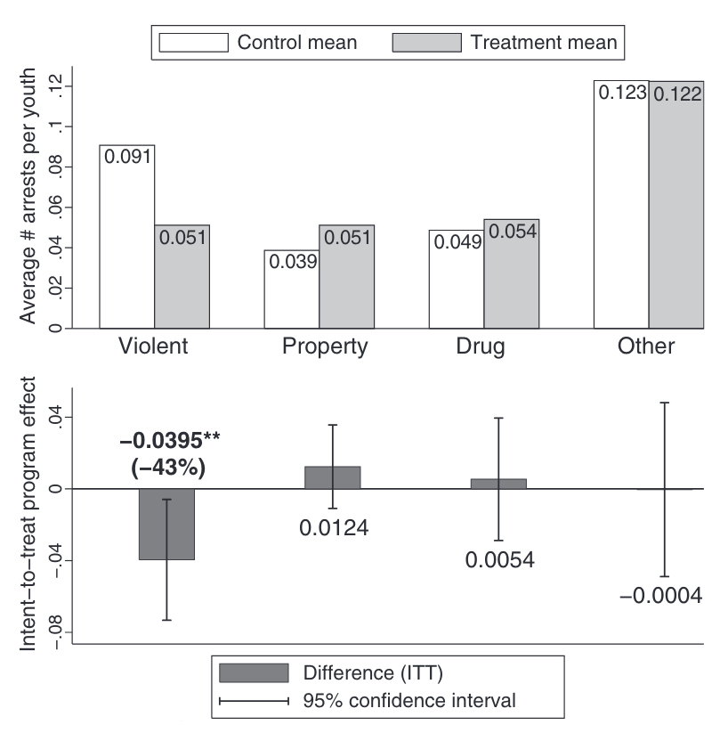
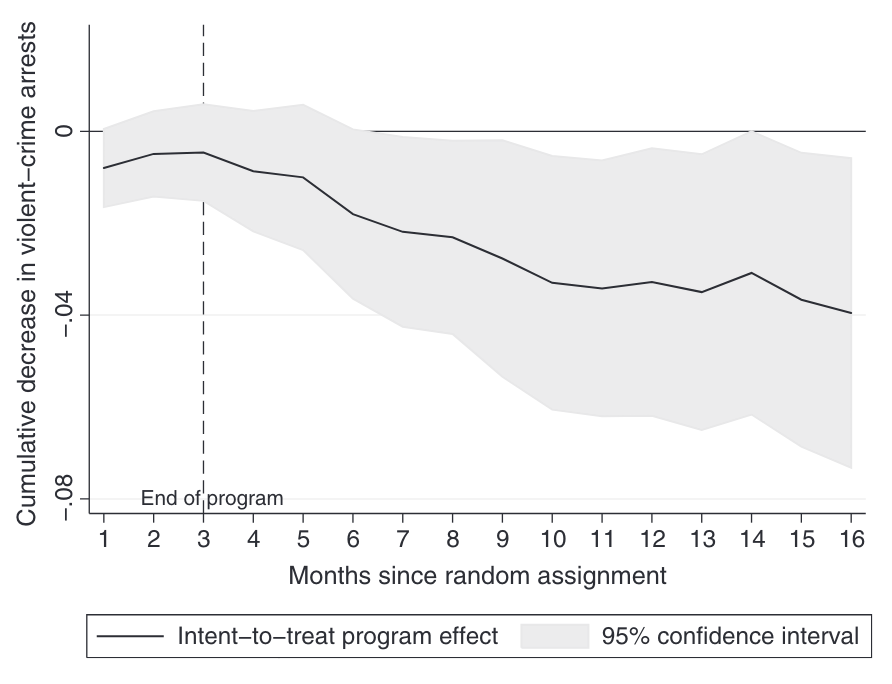
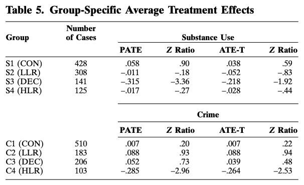
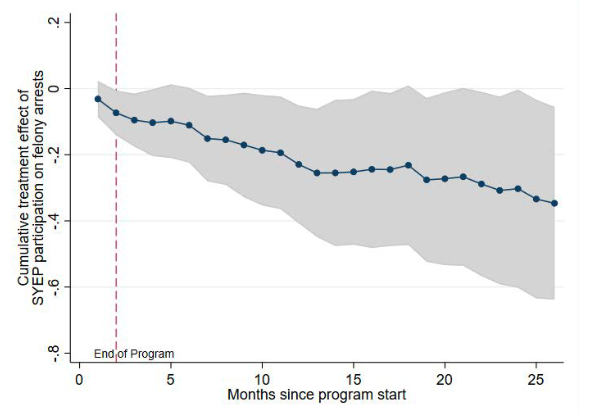
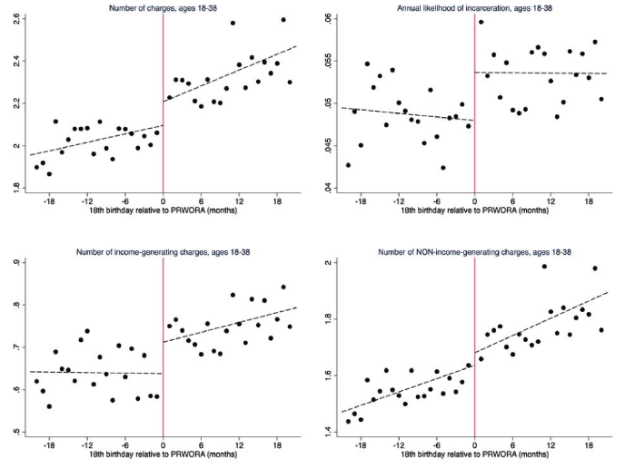

class: center, middle
background-image: url("tsu-logo.jpg")
background-position: 49% 68%
background-size: 40%

# Employment and Crime
## CJ 4310: Special Problems in the Criminal Justice System

<br>
<br>

**Seth Watts, PhD**

School of Criminal Justice & Criminology

<br>
<br>
<br>
<br>
<br>
<br>


November 10, 2025

```{r setup, include=FALSE, echo=FALSE}
xaringanExtra::use_tachyons()
xaringanExtra::use_panelset()
```

---
class: middle

# Overview

1. Why would employment lead to a reduction in crime?

1. The complicated relationship between employment and crime

1. Experimental evidence

---
class: center, middle, inverse

# ↑ Employment/wages ↓ crime mechanisms

---
# Employment - crime link

There are generally 3 (not mutually exclusive) primary explanations for why employment would lead to reduced crime:

<br>

.panelset[

.panel[.panel-name[Social control]

> "Idle hands are the Devil's workshop"

- This argument suggests that simply having a job constrains an individual's amount of free time to engage in criminal activity

- More time spent working = less time available for criminal activity

- More thorough explanations of social control mechanisms suggest that the job:
  - increases involvement in conventional activities;
  - attachment to conventional peers;
  - commitment to conventional life goals
  

]

.panel[.panel-name[Monetary value]

- Pure economic model of decision-making 

- If the income from work offsets the potential gains from criminal activity, the job offers a more legitimate and better path to accumulate money
]

.panel[.panel-name[Human capital + value]

- The job provides the individual with some intrinsic value or worth; conformity to conventional means

- Instead of being surrounded by the same (potentially) criminally active peers, coworkers and patrons may act as information nodes that allow one to accumulate prosocial human capital

- This capital can then be used to influence future decisions and ideally climb the socio-economic latter

- A "dead-end" job does not produce prosocial capital
]
]
---
# Employment - crime link

- The link between employment and crime is generally thought to reduce economic crimes such as theft, burglary, or robbery due to the relationship between unemployment and property crime

- The thought process is that the legitimate income will serve as an alternative way of obtaining material goods
  - Plus, the presence of guns, aggression, and disputes are likely to be unaffected by gaining employment - though, it could reduce the likelihood of having a dispute (more time away from folks one may spat with)

- Much of the evidence supports this argument (Ludwig & Shnepel, 2024)

---
class: center, middle, inverse

# The complicated relationship between employment & crime

---
# Employment - crime link complications

.pull-left[
## Within-individual variation
- Over time there are changes that occur such as maturation, changes in motivation, new friends, or accumulation of human capital

- Solely looking at the effect of employment on crime for one person (or multiple people) over time is going to be confounded by these other factors that also change over time

- Strictly speaking, without adjusting for these other variables that I mentioned, it's not easy to say employment affected criminal activity

]
.pull-right[
## Between-individual variation

- Generally speaking, two phenomena are true:
  1. Employed individuals are qualitatively and quantitatively different than unemployed individuals
  1. Incarcerated individuals are qualitatively and quantitatively different than unemployed individuals

- Because of this, it is problematic to compare employed versus unemployed or incarcerated versus not incarcerated when assessing criminal activity or recidivism rates

- You need to either randomize or approximate randomization to get two groups that are ***similar***
]

---
class: center, middle, inverse

# What does the experimental evidence say?

---
# Employment - Crime: Experimental evidence

.panelset[
.panel[.panel-name[Heller (2014)]

- RCT (random assignment to summer jobs) of 1634 disadvantaged high school youth in Chicago

- Treatment was associated with a reduction of 4 violent crime arrests per 100 youth; a 43% reduction)
<br>

.pull-left[
```{r, echo=FALSE, out.width="80%", fig.align="center"}

```
]
.pull-right[
```{r, echo=FALSE, out.width="80%", fig.align="center"}

```
]
]

.panel[.panel-name[Davis & Heller (2020)]

- Extended Heller (2014) to a follow-up experiment with only males, aged 16-22, and included more "disconnected" youth to see if the treatment works among those most-at-risk

- They replicated their findings from the first experiment
  - Violent crime arrests declines approximately 33% (compared to 43% in the 2014 study)
  - Property crime seems to increase in later years
  - The gains from reduced violence (highly costly) offsets the costs from increased property crime
  
- Importantly, these are lasting effects (2-3 years down the line)

]
.panel[.panel-name[Apel et al. (2007)]

- Apel et al. (2007) use group base trajectory modeling to categorize individuals into high risers (high criminal activity and increase over time), decliners (high criminal activity but decline over time), low risers (criminally active later), conformists (low-rate offending) offenders

- They then see if becoming employed led to reduction in delinquency, while being able to control for baseline offending propensities

- They find no evidence that employment led to reductions in delinquency

<br>
```{r, echo=FALSE, out.width="50%", fig.align="center"}

```
.quote-attrib.center[Negative PATE indicates less overall delinquency; Higher Z-ratio indicates significance (non reach conventional statistical significance)]
]

.panel[.panel-name[Kessler et al. (2021)]

- Kessler et al. (2021) evaluate the effect of the New York City Summer Youth Employment Program (SYEP) - the largest in the US

- Using a lottery system (approximation of random assignment) they are able to determine the treatment effect of the SYEP

- They find that the SYEP reduced arrests and convictions among high risk youth (those with an arrest prior to the program)

<br>

```{r, echo=FALSE, out.width="50%", fig.align="center"}

```
]
]
---
# Supplemental income and crime

- In an adjacent line of research, Deshpande & Mueller-Smith (2022) evaluated the effect of youth losing access to supplemental income (SSI; a form of welfare assistance)

- The legislative reform made it so that there was an eligibility review for individuals receiving SSI on their 18th birthday - prior to the reform date, there was no review 

- Using the date of reform (August 22, 1996) as a natural experiment, they compare offending among those who had their 18th birthday before and after the reform date

- Losing SSI (approx $10,000 annually) was associated with an increase in money generating crime (theft, burglary, robbery, prostitution)

```{r, echo=FALSE, out.width="55%", fig.align="center"}

```

---
# Key Takeaways

- There are a few different mechanisms that may explain why employment would lead to less criminal activity

- RCTs and high quality quasi-experiments tend to show small or null effects (some early studies find employment leads to more crime) ***BUT*** more recent studies (Heller 2014; Davis & Heller, 2020; Kessler et al., 2021) seem to suggest, particularly among youth, that summer work programs are beneficial

- Employment, job programs, and money transfers, for the most part, primarily affect property crime rates

.quote-box[
"Poverty as such does not seem to be an important cause of violent crime. It does *not* seem to be the case that nothing stops a bullet like a job."

.quote-attrib.right[Ludwig & Shnepel (2024)]
]