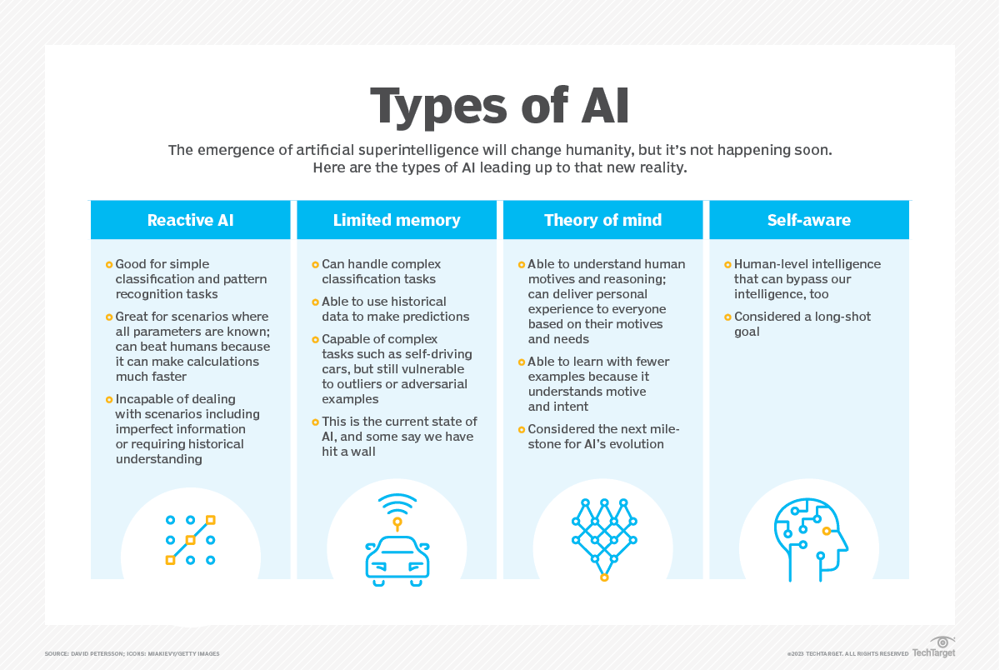
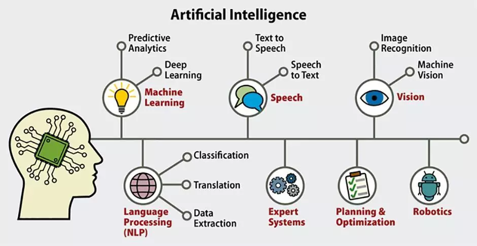
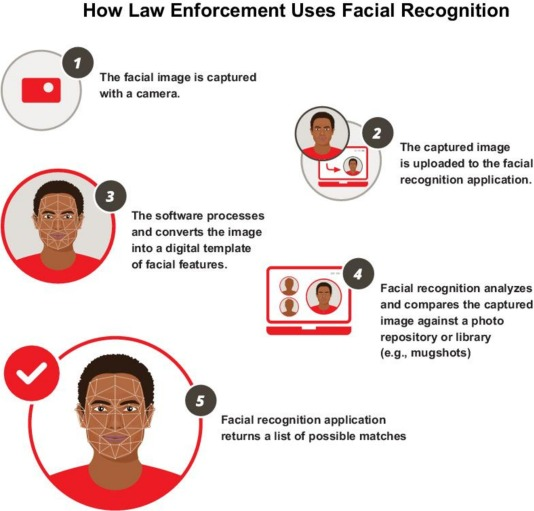
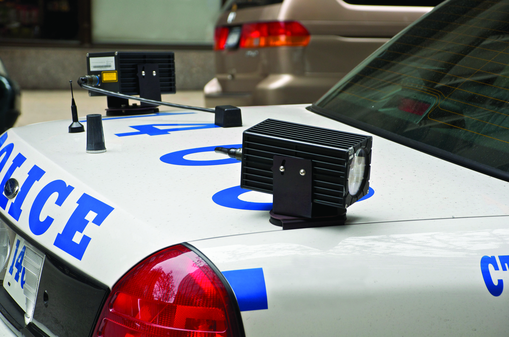
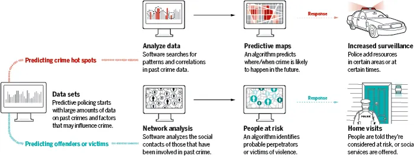

class: center, middle
background-image: url("tsu-logo.jpg")
background-position: 49% 68%
background-size: 40%

# AI & Crime
## CJ 4310: Special Problems in the Criminal Justice System

<br>
<br>

**Seth Watts, PhD**

School of Criminal Justice & Criminology

<br>
<br>
<br>
<br>
<br>
<br>


November 24, 2025

```{r setup, include=FALSE, echo=FALSE}
xaringanExtra::use_tachyons()
xaringanExtra::use_panelset()
```

---
class: middle

# Overview

1. What is AI?

1. AI's application in the criminal justice system

1. How might AI help control crime? Is that even possible?

1. Concerns around AI

---
class: middle, inverse

## First....

---
class: middle, inverse

## First.... What is AI?

---
# Artificial intelligence

```{r, echo=FALSE, out.width="85%", fig.align="center"}

```

---
# Artificial intelligence

```{r, echo=FALSE, out.width="85%", fig.align="center"}

```

---
class: center, middle, inverse

# AI's application to the CJS

---
# Vision and Surveilance 

1. **Facial recognition technology**

- In theory, this should help law enforcement quickly (and accurately) identify suspects

> "Police utilize FRT in three main ways: (a) to identify individuals during stops or arrests, (b) to search video footage for investigations, and (c) to perform real-time scans of people near surveillance cameras." - Johnson et al. (2024)

.pull-left[

]

```{r, echo=FALSE, out.width="50%", fig.align="center"}

```
.quote-attrib.center[[Johnson et al. (2024)](https://www.sciencedirect.com/science/article/pii/S0264275124006863)]

---
# Vision and Surveilance

**Automated license plate readers (ALPRs)**

- As discussed a few weeks ago, ALPRs are able to run plates much quicker than an officer manually calling dispatch

- Primarily adopted to help address auto-related crimes

- Can be setup on patrol vehicles or at fixed locations around the city (e.g., intersection)

<br>
```{r, echo=FALSE, out.width="50%", fig.align="center"}

```
.quote-attrib.center[Automated License Plate Reader]

---
# Audio and natural language processing 

**Gun shot detection systems**

- GDTs are setup across a city to detect gunfire and allow for a quick police response

- This, in theory, allows police to a) apprehend offender(s), b) collect evidence, and c) allow for a quick EMS transport in an efficient manner

- All of which have the potential to deter future gun violence, build a case for an arrest, and save a life

---
# Audio and natural language processing 

**Text based analysis**

- One form of text-based analysis that is being quickly adopted by police departments is AI-based body worn camera (BWC) auditing software

- While not intended to directly reduce crime, structured and detailed AI-assisted report writing could help with investigations

- Moreover, if accurate facial recognition software was integrated into AI-based BWC, this too could lead to better investigations

---
# Audio and natural language processing

**Predictive policing**

```{r, echo=FALSE, out.width="90%", fig.align="center"}

```

- Predicting crime requires big data on previous crime trends, community factors (e.g., median income, vacant units), crime generators (e.g., liquor stores), near repeat victimization, weather, week of year trends, day of week trends, time of day trends, and other data if available

- The algorithm then forecasts where crime is likely to occur 

- Police then use this information to position themselves to prevent offending or apprehend offenders

---
class: center, middle, inverse

# Can AI reduce crime?


---
class: middle, inverse

## Well... AI can't by itself reduce crime (atleast not yet) but can it be an aid?

---
# The evidence

1. Facial recognition technology

  - One of the more rigorous studies to evaluate the effect of FRT on crime and arrests found that it does reduce violent crime but does not increase arrests (Johnson et al., 2024)

1. Predictive policing 

  - Rigorous evidence suggests that predictive police can help reduce crime (Ratcliffe et al., 2021)
  - Other retrospective evaluations generally find more mixed results
  - Note that this effect is driven by police being present in high crime areas that were *identified* by the predictive algorithm
    - Predicting where crime *might* be happens with or without a predictive algorithm

1. ALPRs, text based analysis, GDT

  - The research here is generally mixed (ALPRs), underwhelming (GDT), or not present (text-based)
  - As AI continues to evolve there will be more empirical evaluations of these technologies

---
# Concerns

- As we have discussed throughout this course, there are concerns related to the adoption of new technologies, especially forms of AI

- Fairness, privacy, and other civil rights concerns are the most prominent 

--
  - Is there racial bias present that increases policing of minority individuals?
     - Is the false positive rate higher for Black and Brown individuals?
  - What are the variables included in the predictive policing algorithm?
  - How is the data on civilians used in AI-based BWC review?

---
# Key Takeaways

- The adoption of algorithms and other AI-based technologies is expanding in the criminal justice space

- Much of the research in this area is new and growing

.quote-box[
"With AI technology already in use in large and small ways across the criminal justice field, system leaders, researchers, technology developers, civil society organizations, and community representatives should engage in deliberate and collaborative efforts to chart a path forward for responsible expansion and innovation. Regular dialogue and information-sharing can help flag emerging opportunities, identify and mitigate risks preemptively, and build shared standards and best practices. Responsibly managed, AI has the potential to enhance both safety and justice."

.quote-attrib.right[[Council on Criminal Justice](https://counciloncj.org/the-implications-of-ai-for-criminal-justice/)]
]

