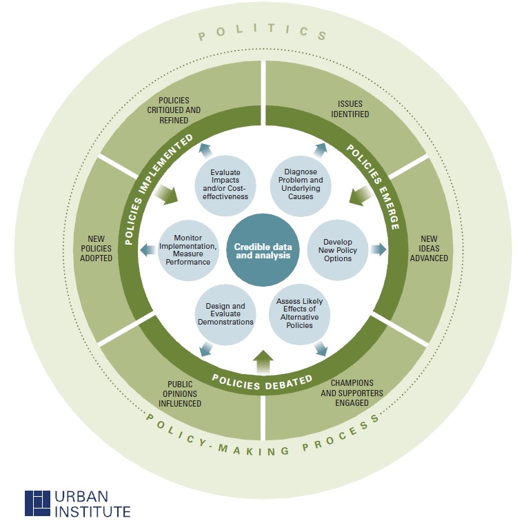
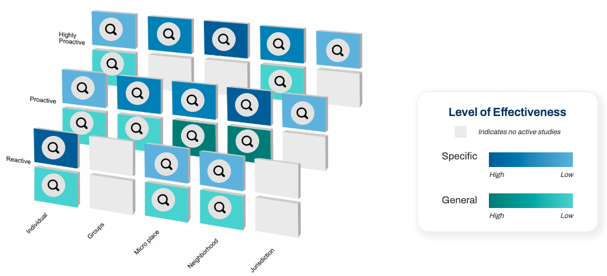
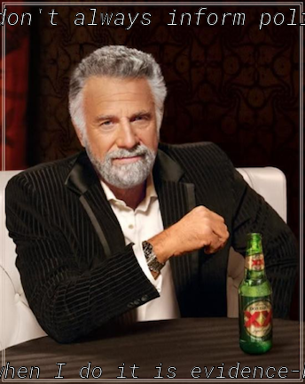

class: center, middle
background-image: url("tsu-logo.jpg")
background-position: 49% 68%
background-size: 40%

# Evidence-Based Crime Policy
## CJ 4310: Special Problems in the Criminal Justice System

<br>
<br>

**Seth Watts, PhD**

School of Criminal Justice & Criminology

<br>
<br>
<br>
<br>
<br>
<br>


September 1, 2025

```{r setup, include=FALSE}
knitr::opts_chunk$set(echo = TRUE)
xaringanExtra::use_tachyons()
xaringanExtra::use_panelset()
xaringanExtra::use_webcam(width = 125, height = 125, margin = "5em")
```
---

class: middle

# Overview

1. What is Evidence-Based Policy (EBP)?

1. Why is EBP Important?

1. Examples of EBP

---
class: center, middle, inverse
## What is EBP?

.quote-box-inv[
"An evidence-based approach requires that the results of rigorous evaluation be rationally integrated into decisions about interventions by policymakers and practitioners alike."

.quote-attrib-inv.right[Petrosino, 2000: p. 635]
]

???
- rigorous evidence should inform decisions on what policies to implement
  - this typically means we know that intervention x has a fairly high degree of effectiveness due to the a) quantity of tests and b) quality of tests
---
# What is EBP?


.pull-left[
```{r, echo=FALSE, out.width="100%", fig.align="center"}

```
.center.small[Source: [Turner, 2013](https://www.urban.org/urban-wire/it-takes-portfolio-tools-make-evidence-based-policy)]]

--

.pull-right[


Producing evidence based policy takes time and requires collaboration between researchers and practitioners

The EBP movement values incremental adjustments over radical swings
  - Incremental adjustments can be rigorously evaluated and terminated if harmful
  - Large-scale radical overhauls, however, are harder to evaluate and likely more difficult to terminate


]

???
- this approach requires collaboration among stakeholders to thoroughly devise, implement, and evaluate
- because there is an emphasis on thorough high-quality evaluations, radical changes are generally viewed suspiciously
---

# Why is this important?

- Taxpayer dollars tend to fund policies

- Local, state, and federal CJ agencies should implement policies that *work*

- Anecdotal evidence and personal opinions influencing policy can be at best ineffective and a waste of resources or at worst, harmful
  - This is not to say that EBPs can't have harmful effects - they can and it is vital to ensure they are minimized

<br>
.quote-box[
"we are all entitled to our own opinions, but not to our own facts."

.quote-attrib.right[Sherman, 1998: p. 4]
]

???
- using finite resources to fund policies that *work*
  - taxpayer dollars ought to not be wasted on ineffective policies

---

# Three Keys to Causal Interpretation

1. Correlation
  - Policy X and outcome Y must be correlated for X to causally impact Y
  - You often hear "correlation does not equal causation" and it is true! But correlation is a pre-requisite for a causal relationship

1. Temporal ordering
  - Policy X ***MUST*** come before any observed change in outcome Y

1. Absence of spuriousness
  - No other potential confounders (e.g., other variables that are driving the change in outcome Y)

<br>

.quote-attrib.right[John Stuart Mill, *Methods of Induction*]

???
- you often here about things causing other things but what does this actually mean?
- it effectively means if not for some intervention, the outcome would not have changed
  - the question of interest is really about a hypothetical world where the intervention did not exist - then we compare the two worlds
  - the trick however is we only truly observe one world, not two. 
---

# The Maryland Scale 

|**Method** | **Maryland Scale**  |
|-------------------------|---------------------------|
|Randomization            |Level 5 (Gold Standard)    |
|Multiple units           |Level 4                    |
|Control                  |Level 3                    |
|Before-After             |Level 2                    |
|Cross sectional; No Randomization  |Level 1              |

.center[Adapted from Sherman et al. (1997)]

- Moving *up* the table improves the researchers ability to say with a level of confidence that the treatment (or intervention) ***caused*** the observed difference between groups

- Studies that are at the bottom of the table suffer from confounding, meaning that it may not be the intervention that is responsible for the difference (e.g., timing, socioeconomic status, gender, race, region)

???
- The ultimate questions are: what groups are we comparing? Are they equivalent?
- Randomization makes groups equivalent because it is *random* (race, gender, socioeconomic status, etc. will be the same between groups)

---
# Main Threats to Internal Validity

|**Threat** | **Description**  | **Example**      |
|-------------------------|---------------------------|-------------------------|
|Selection                |Pre-existing differences drive the observed effect   |Those with high levels of motivation are more likely to go to college |
|History                  |Other event occurring at the same time drives effect |COVID-19 lockdowns occurring at the same time of a new police training program |
|Maturation               |Natural evolution of pre-existing differences or trends drives effect |Age-crime curve
|Instrumentation          |Effect is driven by a methodological artifact such as a change in measurement  |Changing how crime rate is measured before and after an intervention |
|Testing                  |Multiple tests lead to a change   |  Natural improvement from Test #1 to Test #2 |                         
|Regression to the mean   |Reversion of trends back to predictable mean |Arguably, elevated gun violence during COVID-19 was an outlier (and since then it has reverted to the mean) and even lower than the mean
|Differential attrition   |Some people drop out of study that differentially belong to a certain group |Wealthier individuals drop out of study |
|Causal order             |Y comes before X, instead of X coming before Y  |The chicken or the egg? Which came first?

---
# Crime Solutions

.wrap-right[
```{r, echo=FALSE, out.width="70%", fig.align="right"}

```
]

- [Crime Solutions](https://crimesolutions.ojp.gov/), housed by the National Institute of Justice, lists and describes the effectiveness of different policies/programs

- They have a range of topics and varying programs included

- One criticism of this resource is that the ranking system is strict
  - There is some nuance that is missing between effective and limited categorizations, for instance
---
# Evidence-Based Policing Matrix

```{r, echo=FALSE, out.width="85%", fig.align="center"}

```
.center.small[Source: [GMU CEBCP](https://cebcp.org/evidence-based-policing/the-matrix/)]

- The above matrix is a good resource for identifying sound and not-so-sound policing strategies

- Policing strategies are stratified by unit of analysis (e.g., individual, neighborhood), level of focus (e.g. focused or general), and proactivity-level (e.g., highly proactive, proactive, reactive)

---
class: center, middle, inverse
# Examples

---

.pull-left[
## EBP
**Policy:** Hot Spots Policing

**Description:** Crime is highly concentrated geographically. Thus, it may be effective to send officers to areas where crime is most prevalent.

**Evidence:** There are multiple randomized control trials (Gold Standard evidence) suggesting that hot spots policing works to reduce crimes. In a meta-analysis, Braga et al. (2019) found that hot spots policing reduces violent crime, property crime, disorder offenses, and drug crimes. There were larger effects for disorder offenses and drug crimes.
]

--

.pull-right[
## Non-EBP
**Policy:** Gun Buyback Programs

**Description:** To reduce gun violence, gun buyback programs offer cash in return for guns to, ideally, reduce gun violence. These programs are often implemented locally.

**Evidence:** The evidence on this intervention is effectively non-existent. Gun buy-back programs in the US have consistently not had meaningful impacts on crime. It is frequently the case that few guns are turned in, making it unlikely to meaningfully impact gun violence rates. And if guns are turned in, they are guns not used in the commission of gun-related crimes.
]

---

# Moving forward

- As we move through this course be sure to pay close attention to how researchers discuss certain policies in terms of their research base

- We will be covering many different crime control policies; Some with strong, mixed, and weak evidence

- While evidence for a policy may be strong, it is important to recognize that there is not an ironclad solution that works 100% of the time for everyone

<br>

.quote-box[
"There are no solutions. There are only trade-offs."

.quote-attrib.right[Thomas Sowell, *A Conflict of Visions: Ideological Origins of Political Struggles*]
]

---

# Key Takeways

- Not all evidence is created equal

- Higher levels of internal validity means increased confidence that policy X effects outcome Y

- A policy's evidence base should be analyzed by looking at the quality (Maryland Scale) and quantity (e.g., Tests in multiple jurisdictions? Do most papers suggest effects?) of evidence

- The evidence-based movement is about rigorously testing interventions and providing evidence to policymakers to help inform their decisions

```{r, echo=FALSE, message=FALSE, warning=FALSE, fig.align='center', out.width="30%"}
library(memer)
library(tidyverse)

meme <- meme_get("DosEquisMan") %>% 
  meme_text_top("I don't always inform policy", size = 20) %>% 
  meme_text_bottom("But when I do it is evidence-based", size = 16)

# Save to file
magick::image_write(meme, "meme-ebp.png")

# Include cleanly


```
.center[Generated with [`memer`](https://github.com/sctyner/memer) in R]

