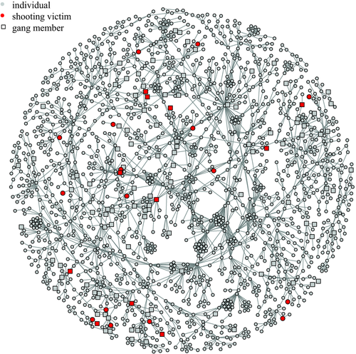
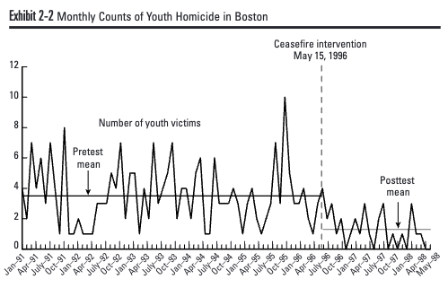
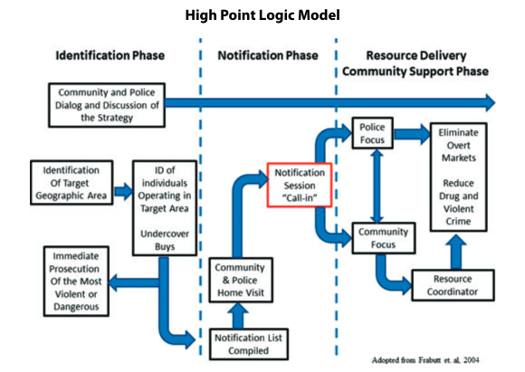
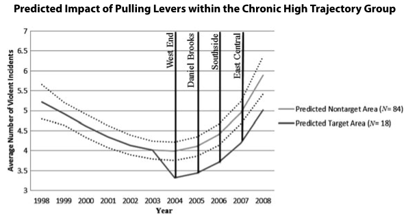

class: center, middle
background-image: url("tsu-logo.jpg")
background-position: 49% 68%
background-size: 40%

# Police II: Focused Deterrence
## CJ 4310: Special Problems in the Criminal Justice System

<br>
<br>

**Seth Watts, PhD**

School of Criminal Justice & Criminology

<br>
<br>
<br>
<br>
<br>
<br>


September 22, 2025

```{r setup, include=FALSE}
knitr::opts_chunk$set(echo = TRUE)
xaringanExtra::use_tachyons()
xaringanExtra::use_panelset()
```
---
class: middle

# Overview

1. What is Focused Deterrence

1. Examples of Focused Deterrence

1. The Evidence for Focused Deterrence

1. Critiques

---
class: center, middle, inverse

# What is Focused Deterrence?

---
class: center, middle
# But first, what is deterrence?

---
# Deterrence

<div style="position: absolute; top: 16em; right: 25em; width: 300px;">

<p style="font-size: 0.75em; text-align: center; margin-top: 0.1em; display: block; width: 100%;">Cesare Beccaria, 1738-1794</p>
</div>

<div style="position: absolute; top: 16em; right: 5em; width: 300px;">

<p style="font-size: 0.75em; text-align: center; margin-top: 0.1em; display: block; width: 100%;">Jeremy Bentham, 1748-1832</p>
</div>

- *Certain*, *swift*, and *severe* (severe enough to offset the potential gains of criminal activity) yet proportional punishment will prevent law violating behavior

- Assumption that humans are rational actors who are hedonistic (maximize pleasure, minimize pain)


---
class: center, middle

# Now, let's apply deterrence theory in a focused manner

---
# Focused Deterrence

<div style="position: absolute; bottom: 8em; right: 8em; width: 600px; height: 400px;">
<iframe width="100%" height="100%" 
        src="https://www.youtube.com/embed/tre0ERGEFIA" 
        frameborder="0" 
        allow="accelerometer; autoplay; clipboard-write; encrypted-media; gyroscope; picture-in-picture" 
        allowfullscreen>
</iframe>

</div>

---
# Focused Deterrence

<div style="position: absolute; top: 6em; right: 0em; width: 550px;">

<p style="font-size: 0.75em; text-align: center; margin-top: 0.1em; display: block; width: 100%;">Papachristos et al. 2015</p>
</div>

.pull-left[
- Shootings are generally concentrated among high-risk individuals (just like high-risk streets)

- Shooters and shooting victims tend to overlap (e.g., victim-offender overlap)
  - Also, family and friends have a greater risk of being victimized

- Policy can focus on these individuals to reduce gun violence
]

???
- you can think of your friend group as a clustering of people who generally like the same things (loosely): that's partially why youre friends!

- the same is true for criminal networks: gang members/criminal groups hang with each other because of their circumstances and share similar risk profiles to engage in crime and be victimized

- You may have a couple friends that you go out on the town with and then you may have a couple friends you like to talk politics with, BUT these two friend groups may not overlap that much. The friends you go out with on the town are likely to have a higher risk of getting in trouble because of the nature of the activities you engage in when together.
---
# Focused Deterrence

**Two messages**:
  - Agree to stop engaging in gun violence and you can access a host of social services that may be of use to you (*carrot*)

  - If you do not stop, law enforcement knows where you tend to frequent, they know your associates, and you will be arrested (*stick*)

--

**Important**:

  - This message is not solely delivered by the police
  
  - Family, friends, revered community figures (e.g., pastors), among others openly try to persuade the high-risk individuals away from gun violence
  
---
class: center, middle, inverse

# Operation Ceasefire
Kennedy et al. (2001)

---
# Operation Ceasefire 

<div style="position: absolute; top: 6em; right: 1em; width: 450px;">

<p style="font-size: 0.75em; text-align: center; margin-top: 0.1em; display: block; width: 100%;">David Kennedy</p>
</div>

.pull-left[
- The first focused deterrence approach in the late 90s
  - Focused on youth gang violence in Boston, MA
  
- Also referred to as "pulling levers" approach

- The goal:
  - Drive down youth gun violence by targeting chronic offenders with the certainty of punishment (*stick*) and using mediators to divert them away (*carrot*)
]

???
- The Boston Gun Project Working Group began meeting in January 1995. By the fall of that year, the Project’s basic problem assessment had been completed and the elements of what is now known as the Operation Ceasefire intervention mapped out;implementation began in early 1996. 

- The two main elements of Ceasefire were a direct law enforcement attack on illicit firearms traffickers supplying youths with guns and an attempt to generate a strong deterrent to gang violence. The second strategic element, which became known as the “pulling levers”strategy, involved deterring the violent behavior (especially gun violence) of chronic gang offenders by— Targeting gangs engaged in violent behavior. Reaching out directly to members of the targeted gangs. Delivering an explicit message that violence would not be tolerated. Backing up that message by “pulling every lever”legally available (i.e., applying appropriate sanctions from a varied menu of possible law enforcement actions) when violence occurred.
---
# Operation Ceasefire

```{r, echo=FALSE, out.width="90%", fig.align="center"}

```
.center.small[Source: [Kennedy et al. (2001)](https://www.ojp.gov/pdffiles1/nij/188741.pdf)]

???
- Using carefully constructed, generalized linear models that controlled for trends and seasonal variations, they found that the implementation of Operation Ceasefire was associated with a 63-percent decrease in youth homicides per month,a 32-percent decrease in shots-fired calls for service per month,a 25-percent decrease in gun assaults per month,and a 44-percent decrease in the number of youth gun assaults per month in the highest risk district (Roxbury).
---
class: center, middle, inverse

# Drug Market Intervention
Corsaro et al. (2012)

---
# High Point Drug Market Intervention

- Target individuals operating within drug markets in High Point, NC
  - Violent offenders were arrested
  - Non-violent offenders were notified of a "call-in" session and went through a needs assessment for local social services

```{r, echo=FALSE, out.width="75%", fig.align="center"}

```
.center.small[Source: [Corsaro et al. (2012)](https://research.ebsco.com/c/siow6l/viewer/pdf/rgec7zg2rb)]

???
- first, researchers identified high density violent crime areas within drug markets
- second, call-in sessions were conducted "the pulling levers" aspect. Violent offenders were arrested, nonviolent offenders were offered services following a needs assessment.
---
# High Point Drug Market Intervention

- Target individuals operating within drug markets in High Point, NC
  - Violent offenders were arrested
  - Non-violent offenders were notified of a "call-in" session and went through a needs assessment for local social services

```{r, echo=FALSE, out.width="75%", fig.align="center"}

```
.center.small[Source: [Corsaro et al. (2012)](https://research.ebsco.com/c/siow6l/viewer/pdf/rgec7zg2rb)]

???
- DiD models suggest an 18% decline in violent crime
- A more conservative estimate suggests 12.8% decline
---
class: center, middle, inverse

# Meta-analysis
Braga, Weisburd, & Turchan (2018)

---
# Meta-analysis

| **Crime category**         | **Effect size**  |
|----------------------------|------------------|
|Overall                     |.383*             |
|Drug Market Intervention   |.091*             |
|Gang/Group                  |.657*             |
|High-risk Individuals       |.204*             |
|Matched Quasi-experiment    |.194*             |
|Non-matched Quasi-experiment|.703*             |

--

.quote-box[
"Although the evaluation evidence needs to be strengthened with rigorous randomized experimental field trials, and more developed study of the theoretical mechanisms underlying its impacts, our review suggests that jurisdictions suffering from gang violence, overt drug markets, and repeat offender problems should add focused deterrence strategies to their existing portfolio of prevention and control interventions."

.quote-attrib.right[[Braga, Weisburd, & Turchan, 2018](https://onlinelibrary.wiley.com/doi/abs/10.1111/1745-9133.12353?casa_token=AV0TMLvfW2gAAAAA%3ATqTkrJcQvIJUUyUIE1RntnnWJPaSazFkb8sNjCtkRNlBIPqOLEdNzqKWN6KpStKizVgWxMs5D844yw)]

]


---
class: center, middle, inverse

# Critiques of Focused Deterrence

---
# No Randomized Field Experiments

- Often times the intervention is city-wide so it is hard to find a reasonable comparison group

- The best available studies are level 3 and 4 on the Maryland scale (matched and non-matched evaluations)

|**Method** | **Maryland Scale**  |**Present for FD research?** |
|-------------------------|---------------------------|---------|
|Randomization            |Level 5 (Gold Standard)    |☒ |
|Multiple units           |Level 4                    |☑ |
|Control                  |Level 3                    |☑ |
|Before-After             |Level 2                    |☑ |
|Cross sectional; No Randomization  |Level 1          |☑ |

---
# Somewhat Opaque Mechanisms

- What is driving the decline in violence?

--

- Is it the certainty of punishment? The swiftness? The severity of punishment? The messages from family, friends, or community members? The services offered? The perceived legitimacy of the process? A combination of the above?

---
# Locally Tailored

- Crime problems, political will, agency capacity, inter-agency collaboration, funding, and many other factors vary from city-to-city

- Taking Boston's Operation Ceasefire and directly replicating it in Austin, TX would likely not work
  - This also may not be desired! Different crime problems may necessitate different approaches

---
# Key Takeaways

- Focused Deterrence has been shown to be effective at reducing gun violence

- Directed messages indicating the certainty of punishment likely contributes to reduced violence
  - It also helps prevent net-widening (e.g., incarceration of lower-level offenders)

- Despite no randomized control trials and the difficulties with implementation, it is an evidence-based practice

<br>
--
.quote-box[
"[S]trategies that result in large and visible shifts in apprehension risk are most likely to have deterrent effects that are large enough not only to reduce crime but also apprehensions...”

.quote-attrib.right[Durlauf & Nagin (2011: p. 40)]
]

