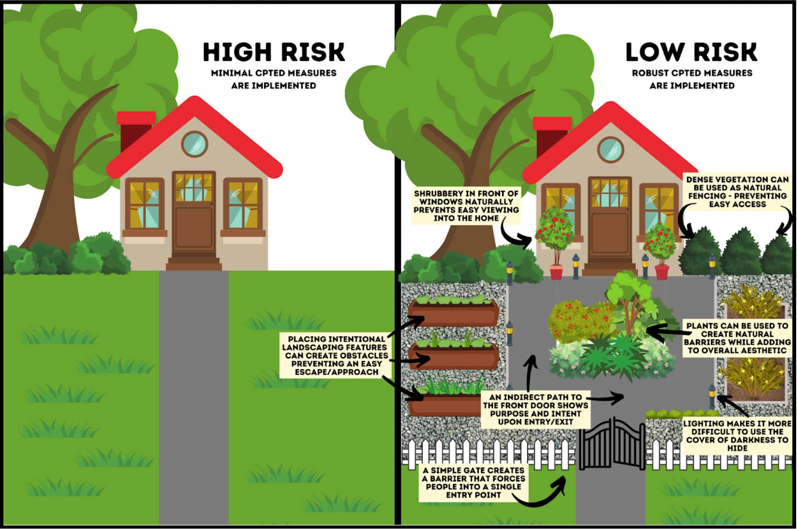
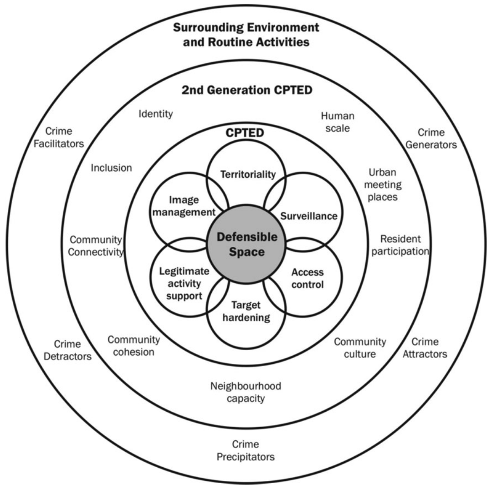
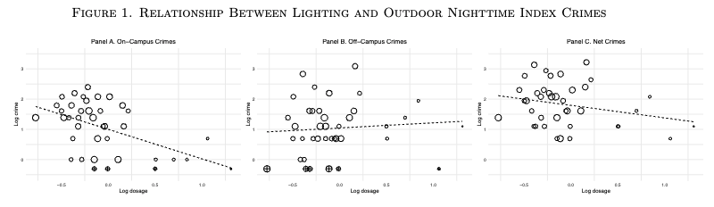
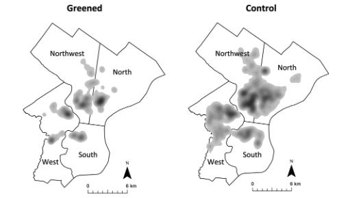
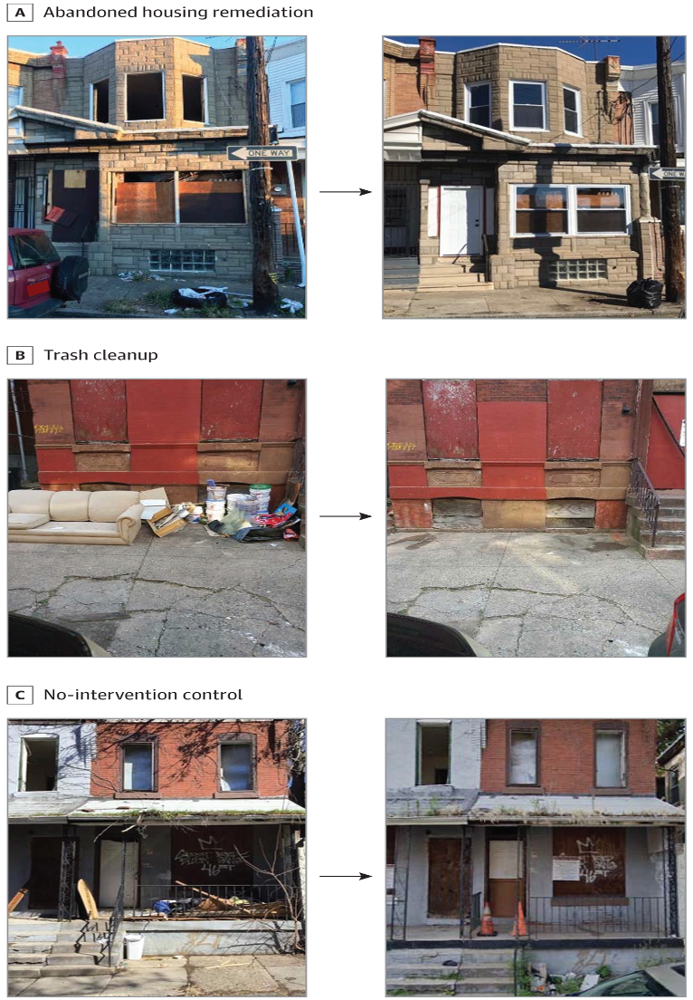

class: center, middle
background-image: url("tsu-logo.jpg")
background-position: 49% 68%
background-size: 40%

# Community-based I: CPTED
## CJ 4310: Special Problems in the Criminal Justice System

<br>
<br>

**Seth Watts, PhD**

School of Criminal Justice & Criminology

<br>
<br>
<br>
<br>
<br>
<br>


October 20, 2025

```{r setup, include=FALSE}
knitr::opts_chunk$set(echo = TRUE)
xaringanExtra::use_tachyons()
xaringanExtra::use_panelset()
```

---
class: middle

# Overview
1. What is crime prevention through environmental design (CPTED)?

1. Empirical studies of CPTED interventions

1. Critiques of CPTED

1. Is CPTED evidence-based?

---
class: center, middle, inverse

# What is CPTED?

Cozens & Love (2015)

---
# CPTED

CPTED is built on the assumption that humans are generally rational actors who act on opportunity

Humans are rational actors also want to maximize their gains and avoid risk/punishment

The physical environment can alter an offender's calculation of potential gains and potential risks

If the risk of being caught is high; access and egress are limited; there are too many obstacles to overcome, the risks may outweigh the potential gains of committing a crime

---
# CPTED Assumptions

These assumptions do have some merit, at least based on some qualitative studies:

1. Decker, Wright, & Logie (1993) risk of being caught and the potential gain form offending were significant predictors of decision-making in a sample of active residential burglars

1. Carmel-Gilfilen (2011) self-admitted shoplifters noted that in-store video cameras and clothing security tags impacted decision to shoplift

1. Armitage (2018) 22 incarcerated "prolific burglars" identified physical features of residential houses that would influence their decision making

---
# Elements of CPTED

1. **Territoriality**: distinct demarcation of legitimate ownership (e.g., fences)

1. **Surveillance**: acts in tandem with access control to promote territoriality (e.g., windows facing sidewalk); mechanical surveillance (e.g., CCTV, street lighting)

1. **Access control**: controls who can access (e.g., locks, key cards)

1. **Target hardening**: increases effort and risk of offending (e.g., ring cameras, lighting, door locks)

1. **Legitimate activity support**: signage to promote acceptable behavior; safe activities attract legitimate users of public space

1. **Image management**: routine maintenance of built environment to indicate care of area and to reduce fear of crime

---
# CPTED

```{r, echo=FALSE, out.width="90%", fig.align="center"}
knitr::include_graphics("ring.png")
```

.center["You are being recorded."]
---
# CPTED

```{r, echo=FALSE, out.width="90%", fig.align="center"}

```
.center.small[Source: [Rise Stockton](https://risestockton.org/crime-prevention)]

---

.pull-left[
# .center[First-gen CPTED]

- Primarily focused on the physical environment and the seven related concepts described before
]

--
.pull-right[
# .center[Second-gen CPTED]

- Incorporates community culture and cohesion as important contextual factors 

- Introduces how land use and crime opportunities play a role (e.g., crime attractors, generators, etc.)
]

--
```{r, echo=FALSE, out.width="40%", fig.align="center"}

```
.center.small[Source: Cozens & Love (2015)]

---
class: center, middle, inverse

# Empirical tests of CPTED

---
# Street Lighting

```{r, echo=FALSE, out.width="90%", fig.align="center"}

```
.center[Source: [Chalfin et al. (2022)](https://www.nber.org/system/files/working_papers/w25798/w25798.pdf)]

The first randomized field experiment of street lighting

Street lighting was randomly allocated to public housing developments in NYC (40 treatment, 40 control developments)

.quote-box[
"...lighting reduces outdoor nighttime index crimes by approximately 36 percent and reduces overall index crimes by approximately 4 percent in affected communities, an outcome which is likely to be cost-beneficial, should the impact of lighting persist over time. Importantly, lighting offers cities a promising method to reduce crime while avoiding potential unintended costs associated with reliance on incapacitation, which has been shown to have high collateral costs."

]
---
# Tree coverage "Greening"

Greening vacant lots and planting trees are also CPTED interventions 

Branas et al. (2011) compare areas that received "greening" efforts in vacant lots versus control areas (no greening) in Philadelphia

```{r, echo=FALSE, out.width="50%", fig.align="center"}

```
.center[Source: [Branas et al. (2011)](https://coolgreentrees.org/wp-content/uploads/2024/04/A-Difference-in-Differences-Analysis-of-Health-Safety-and-Greening-Vacant-kwr273.pdf)]

.quote-box[
"In terms of safety, our analyses showed that vacant lot greening was associated with gun assaults, which were significantly reduced citywide after the greening treatment. Vandalism and criminal mischief were also significantly reduced after the greening treatment in at least 1 section of Philadelphia. In terms of health, vacant lot greening was associated with residents’ reporting significantly less stress and more exercise in select sections of Philadelphia."

]
---
# House Remediation

```{r, echo=FALSE, out.width="45%", fig.align="center"}

```
.center[Source: [South et al. (2022)](https://jamanetwork.com/journals/jamainternalmedicine/fullarticle/2799226)]

---
# House Remediation

House remediation entails cleaning the property as well as installing working features (e.g., windows, doors, fences, lawn maintenance)

South et al. (2022) looked at how full remediation and trash only cleanup affect various offenses compared to the control locations

> In this citywide cluster randomized trial of abandoned house interventions, full house remediation was linked to reductions in gun violence outcomes.

They found that the full remediation was associated with reduction in weapons violations and gun assaults

---
class: center, middle, inverse

# Critiques of CPTED

---
# Critiques of CPTED

Doesn't address underlying factors associated with crime (e.g., "root causes" such as poverty)

--

Assumes offenders are calculating risk
  - What about offenders who are under the influence?
  
--

Risk of crime displacement to other areas
  - Similar to the critique for hot spots policing

--

Increase of surveillance among marginalized communities
  - With crime being concentrated geographically among predominately Black and Brown communities, some CPTED interventions could increase surveillance of these communities
  
---
class: center, middle, inverse

# Is CPTED evidence-based?

---
# Is CPTED Evidence-based?

The short answer is...yes but with caveats

Street lighting has a solid evidence-base suggesting it is useful in reducing crime

Greening vacant lots and increased tree coverage are generally associated with reductions in certain crimes

House remediation is also associated with reduction in gun violence offenses

--
Often times, however, these studies are not randomized and so some caution should be used 

And many low-hanging fruit CPTED interventions don't receive much research attention (e.g., door cameras, door locks, shrub height)

---
# Key Takeaways

CPTED interventions offer a way to reduce crime and arrests which limits the harms of incarceration
  - A two-for-one!
  
Community and local government efforts to reduce crime without the use of criminal justice agents

CPTED interventions are accessible to most people

<br>

.quote-box[
The use of design and CPTED ideas goes back a long way and CPTED-style security measures can be traced to early human settlements. These include the establishment of iron-age forts and castles, which used landscaping, walls, moats, and drawbridges to control access.

.quote-attrib.right[Cozens & Love (2015)]
]