class: center, middle
background-image: url("tsu-logo.jpg")
background-position: 49% 68%
background-size: 40%

# Guns, Policy, and Crime
## CJ 4310: Special Problems in the Criminal Justice System

<br>
<br>

**Seth Watts, PhD**

School of Criminal Justice & Criminology

<br>
<br>
<br>
<br>
<br>
<br>


November 17, 2025

```{r setup, include=FALSE, echo=FALSE}
xaringanExtra::use_tachyons()
xaringanExtra::use_panelset()
```

---
class: middle

# Overview

1. Gun prevalence in the US

1. Gun violence trends

1. Gun policies & their impact on gun-related deaths

---
# Firearm prevalence 

```{r, echo=FALSE, out.width="75%", fig.align="center"}
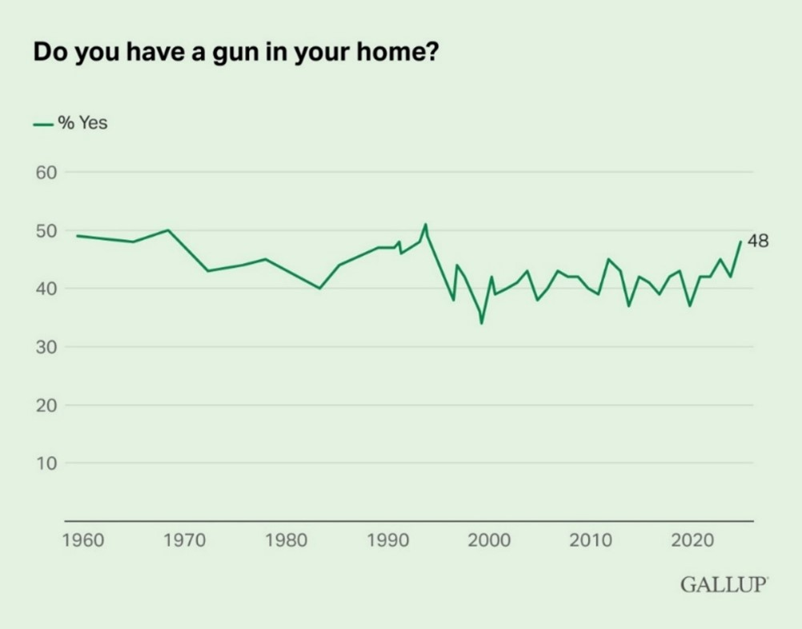
```
.quote-attrib.center[[Gallup](https://news.gallup.com/poll/1645/guns.aspx)]

---
# Firearm Prevalence

```{r, echo=FALSE, out.width="75%", fig.align="center"}
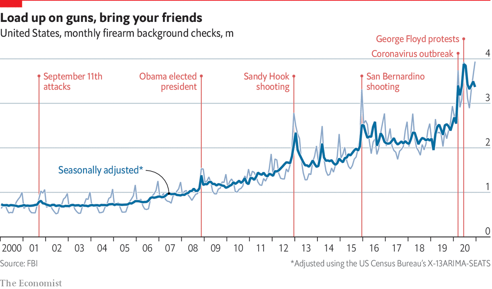
```
.quote-attrib.center[[The Economist](https://www.economist.com/graphic-detail/2021/01/14/fbi-background-checks-a-proxy-for-gun-sales-surged-in-2020)]

---
# Gun violence trends

It is useful to breakdown "gun violence" into four categories:

--

1. Gang/urban violence

--

1. Suicide

--

1. Domestic violence

--

1. Mass shootings


---
# Gun Violence trends

.panelset[
.panel[.panel-name[Gang/urban violence]

- Tit-for-tat gun violence over drugs, turf, or disputes

- Gun homicides disproportionately affect young, Black men in urban areas
.pull-left[
```{r, echo=FALSE, out.width="70%", fig.align="center"}
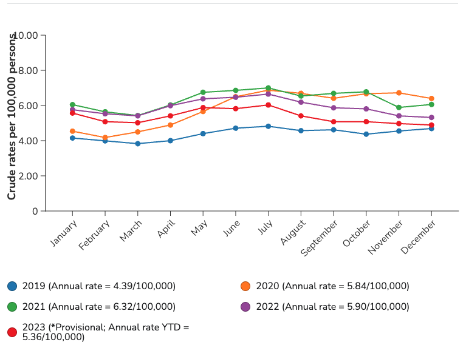
```
.quote-attrib.center[[CDC (2024)](https://www.cdc.gov/firearm-violence/php/data-trends/firearm-homicide-trends.html)]
]

.pull-right[
```{r, echo=FALSE, out.width="70%", fig.align="center"}
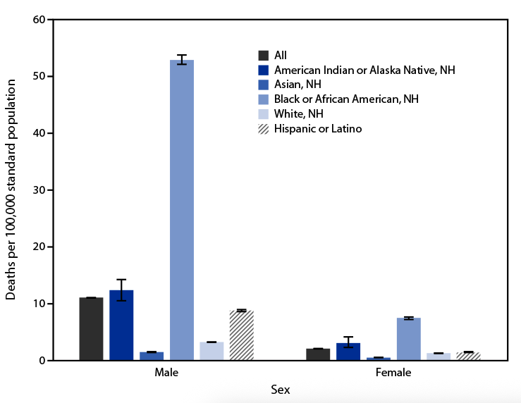
```
.quote-attrib.center[[CDC (2021)](https://www.cdc.gov/mmwr/volumes/72/wr/mm7226a9.h)]
]
]
.panel[.panel-name[Suicide]

- Suicides by firearm represent the majority of gun-related deaths in the US
  - In 2023, 58% of gun-related deaths were due to suicide (38% homicide)
  
- Firearms were used in just over 50% (55%) of the suicides in 2023 (primarily handguns)

.pull-left[
```{r, echo=FALSE, out.width="90%", fig.align="center"}
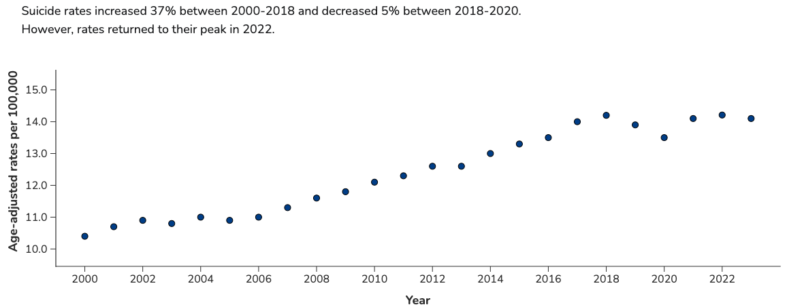
```
.quote-attrib.center[[CDC](https://www.cdc.gov/suicide/facts/data.html)]
]
.pull-right[
```{r, echo=FALSE, out.width="85%", fig.align="center"}
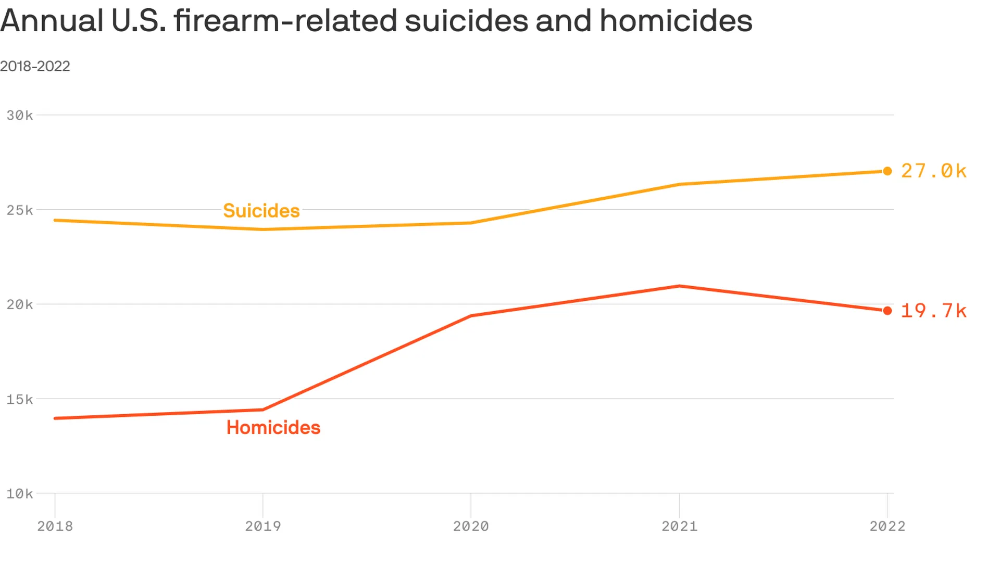
```
.quote-attrib.center[Data: CDC, Visual: [Axios](https://www.axios.com/2024/06/10/gun-violence-suicide-homicide-statistics)]
]
]
.panel[.panel-name[Intimate partner violence (IPV)]

- IPV gun-related murders increased by 26% between 2010 and 2017

- Since approximately 2014, the use of a firearm in IPV murders has increased

.pull-left[
```{r, echo=FALSE, out.width="95%", fig.align="center"}
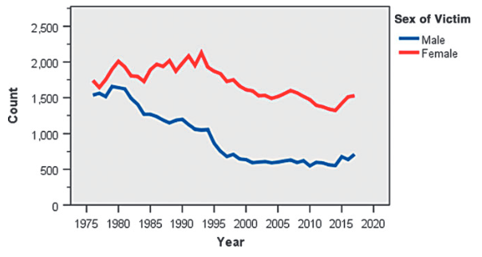
```
.quote-attrib.center[IPV homicide frequency]
]
.pull-right[
```{r, echo=FALSE, out.width="95%", fig.align="center"}
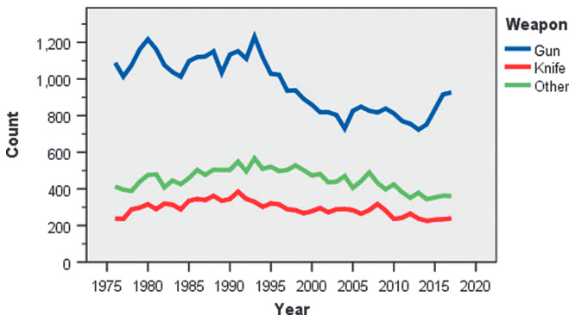
```
.quote-attrib.center[Type of weapon used: IPV homicide ]
]
.quote-attrib.center[[Fridel & Fox (2019)](https://www-liebertpub-com.libproxy.txstate.edu/doi/pdf/10.1089/vio.2019.0005)]
]

.panel[.panel-name[Mass killings]

- The definition used here is "...the intentional killing of four or more victims – excluding the deaths of unborn children and the offender(s) – by any means within a 24-hour period."

- This differs from other definitions that include "mass shootings that *injure* large numbers but may not kill anyone." - Gun Violence Archive

- Mass killings represent a small fraction of the total number of gun homicides (under 2%)

.pull-left[
```{r, echo=FALSE, out.width="65%", fig.align="center"}
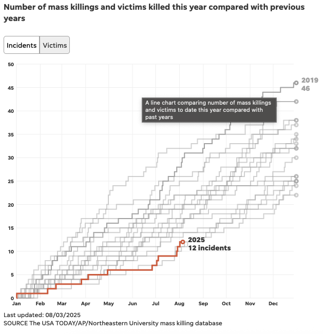
```
]
.pull-right[
```{r, echo=FALSE, out.width="65%", fig.align="center"}
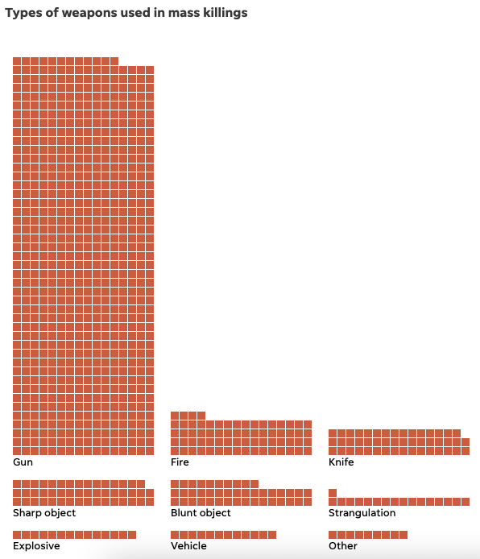
```
]
.quote-attrib.center[[Mass Killings Database: USA Today](https://www.usatoday.com/in-depth/graphics/2022/08/18/mass-killings-database-us-events-since-2006/9705311002/)
]
]

]
---
class: middle, inverse

## Is there anything to be done about this?

<br>

--
Much of what we have discussed thus far in the class does deal with addressing gun violence - particularly gang/urban gun violence - but we have not discussed gun policy/legislation

---
# Public Perceptions of Gun Policy

```{r, echo=FALSE, out.width="75%", fig.align="center"}
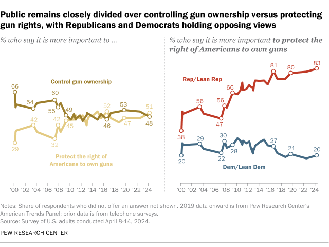
```
.quote-attrib.center[[Pew Research](https://www.pewresearch.org/short-reads/2024/07/24/key-facts-about-americans-and-guns/)]

---
# Gun Policy

- There are a host of policies that govern the sale, use, and storage of firearms

.center[**Policies/Legislation**]

|                                |                                |
|--------------------------------|--------------------------------|
| Gun free zones                 | Gun buy-back programs         |
| Conceal carry laws             | Prohibitions re domestic violence |
| Child access prevention laws   | Background checks              |
| Stand your ground laws         | High capacity magazine bans    |
| Waiting periods                | Red flag laws                  |
| Minimum age requirements       | Licensing and permitting       |

- From a pure empirical perspective the sole interest should be to understand the impact of each policy on outcomes of interest

  - Firearm-related deaths (urban violence, suicide, IPV, mass shootings)
  - Robbery
  - Unintentional firearm-related deaths
  - Stolen firearms
  - Uses of self-defense
---
class: middle, inverse

## Gun policy is highly political

<br>

--
Unfortunately, sound empirical evidence does not generally drive the discussion around gun policy - it is usually emotional, anecdotal, and fueled by interest groups

---
# What *decreases* gun deaths?

.panelset[
.panel[.panel-name[CAP laws]

> "Child-access prevention (CAP) laws allow prosecutors to bring charges against adults who intentionally or carelessly allow children to have unsupervised access to firearms."

- CAP laws have moderate and strong evidence suggesting they can reduce suicides, firearm suicides, firearm homicides, and unintentional firearm injuries or death

  - These findings are specific to children and young individuals
  
```{r, echo=FALSE, out.width="65%", fig.align="center"}
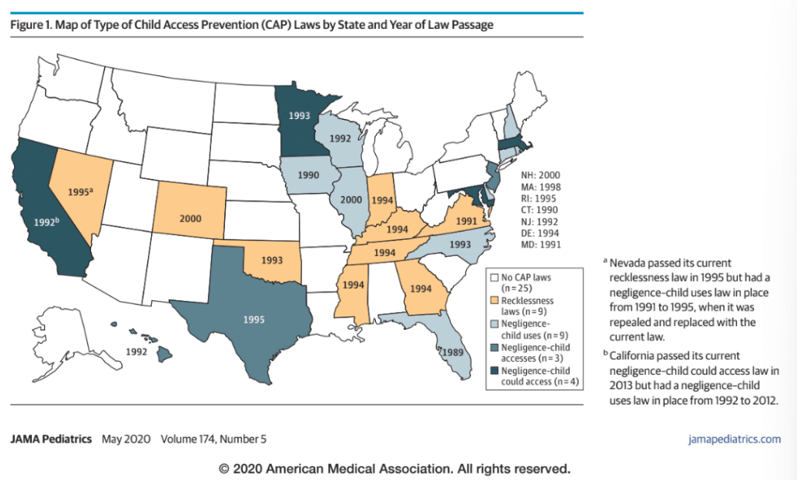
```
]

.panel[.panel-name[Waiting periods]

- Waiting periods refer to implementing a delay between purchase and delivery of a firearm (typically days or weeks)
  - As of 2021, California and Washington, DC had a 10 day waiting period; Hawaii had a 14 day waiting period
  - Other states that have a waiting period tend to have shorter timelines

- Waiting periods appear to have limited evidence reducing total suicides and moderate evidence reducing firearm suicides

- Waiting periods may also reduce total homicides (moderate evidence)

```{r, echo=FALSE, out.width="55%", fig.align="center"}
knitr::include_graphics("waiting-period.png")
```
.quote-attrib.center[[Paul (2021)](https://coloradosun.com/2021/03/24/assaults-weapons-ban-colorado-boulder-shooting/)]
]

.panel[.panel-name[IPV prohibitions]

Since 1968 (Gun Control Act), those convicted of a domestic violence felony are not able to purchase or possess forearms or ammunition

Legislation in 1994 (Violent Crime Control and Law Enforcement Act) also prohibited the possession or purchase of a firearm while under a non-temporary restraining order

- There is moderate evidence that firearm prohibitions for individuals with a restraining order reduces IPV homicides and firearm homicides

- There is moderate evidence that surrender of firearms by prohibited possessors (such as those with DV restraining orders) reduces firearm-involved IPV homicides

]
.panel[.panel-name[Minimum age requirements]

- Moderate evidence suggests that raising the minimum age of firearm purchase to 21 reduces firearm suicides

- Though this is concentrated among those who get the firearm though legitimate means

  - Most report getting a firearm from a friend


]
]

---
# What *increases* gun deaths?

.panelset[
.panel[.panel-name[Shall issue laws]

- Shall-issue laws (or right-to-carry laws) pertain to the guaranteed right to carry a concealed weapon, so long as one is not prohibited from possessing a firearm (e.g. failed background check)

- This differs from may-issue laws which adds in a layer of permitting discretion to law enforcement

- In *New York State Rifle and Pistol Association v. Bruen (2022)* the Supreme Court decided that the use of subjective criteria for granting conceal carry permits was unconstitutional - overturning the may-issue law in NY and other states

.pull-left[
Shall-issue laws are associated with:

  - An increase in total homicides (supportive)
  - An increase in firearm homicides (supportive)
]
.pull-right[
```{r, echo=FALSE, out.width="70%", fig.align="center"}
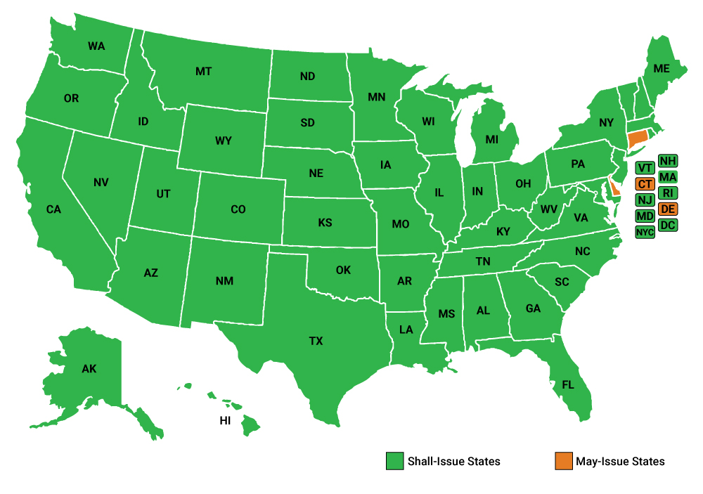
```
.quote-attrib.center[USCCA]
]
]
.panel[.panel-name[Stand-your-ground laws]

- Self-defense as a legal defense has traditionally meant that one must attempt to retreat to safety if the option is available prior to action

- Stand-your-ground laws effectively do away with that requirement lowering the threshold for justifiable lethal force
  - Some have called these laws the "shoot-first laws"

.pull-left[
Stand your ground laws are associated with:

  - An increase in total homicides (moderate)
  - An increase in firearm homicides (supportive)

]
.pull-right[
```{r, echo=FALSE, out.width="70%", fig.align="center"}
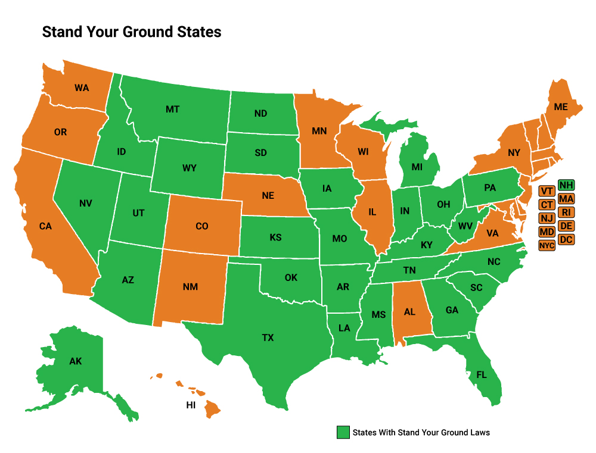
```
.quote-attrib.center[USCCA]
]

]

]

---
# Complications

```{r, echo=FALSE, out.width="70%", fig.align="center"}
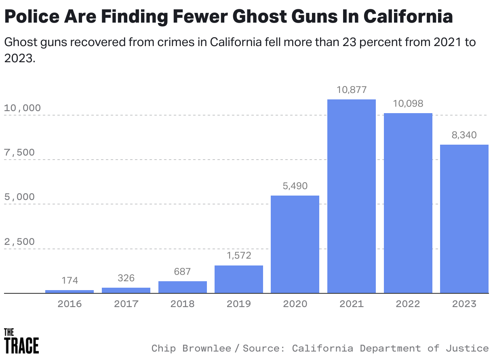
```
.quote-attrib.center[[The Trace](https://www.thetrace.org/2024/11/ghost-guns-decline-regulation-biden-atf/)]

- Biden's 2022 directive for ATF and DOJ to regulate ghost guns seems to have reduced some of the ghost gun recoveries across the US

- Nonetheless, unserialized, 3D printed guns still present problems

---
# Complications

.quote-box[
"In the CCJ survey, a majority of the primary guns (40 of the 48 for which we have detailed information on the source) were obtained from family, fellow gang members, or other social connections...Only 2 of the 70 primary guns (3%) and no secondary guns were reported as purchased directly from a gun store."

.quote-attrib.right[Cook, Parker, & Pollack (2015)]
]

--
.quote-box[
"[Among juveniles] About half of the first gun acquisitions were gifts or finds. The first guns youths acquired were usually obtained from friends or family."

.quote-attrib.right[Webster et al. (2002)]
]

- If offenders are obtaining their firearms from friends, family, gang members, or as gifts, it will be difficult to regulate those transactions

---
# Key Takeaways

- Evaluating state-level policies can be tricky, requiring sophisticated modeling (no true randomization is possible)

- Gun policy is highly political and public debate about gun policy is rarely grounded in the most rigorous, up-to-date evidence

- Some laws do impact gun deaths:
  - CAP laws, waiting periods, IPV prohibitions, and minimum age requirements can reduce gun deaths
  - Shall-issue and stand-your-ground laws can increase homicides and firearm homicides
  
.quote-box[
"Laws designed to change who may buy new weapons, what weapons they may buy, or how gun sales occur will predictably have only a small effect on, for example, homicides or participation in sport shooting, which are affected much more by the existing stock of firearms. Although small effects are especially difficult to identify with the statistical methods common in this field, they may be important. Even a 1-percent reduction in homicides nationally would correspond to approximately 2,500 fewer deaths over a decade."

.quote-attrib.right[Smart et al. (2023)]
]