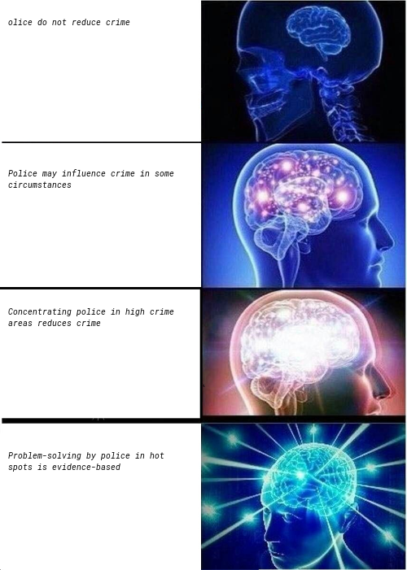

class: center, middle
background-image: url("tsu-logo.jpg")
background-position: 49% 68%
background-size: 40%

# Police I: Crime Control Agents
## CJ 4310: Special Problems in the Criminal Justice System

<br>
<br>

**Seth Watts, PhD**

School of Criminal Justice & Criminology

<br>
<br>
<br>
<br>
<br>
<br>


September 8, 2025

```{r setup, include=FALSE}
knitr::opts_chunk$set(echo = TRUE)
xaringanExtra::use_tachyons()
xaringanExtra::use_panelset()
```
---
class: middle
# Overview

1. Brief Overview of Policing in America

1. The Role of the Police

1. Can the Police Control Crime?

---
class: center, middle, inverse

# Policing in America
Kelling and Moore (1988)

---

# The Evolution of Policing 

- Political era

- Reform era

- Community problem-solving era

```{r, echo=FALSE, out.width="75%", fig.align="center"}
knitr::include_graphics("police-evolution.png")
```
.center.small[Source: [Washington Post](https://www.washingtonpost.com/news/the-watch/wp/2014/04/02/evolution-of-the-american-police-officer/)]


---
# Political Era

<div style="position: absolute; top: 6em; right: 1em; width: 400px;">

  <p style="font-size: 0.75em; text-align: center; margin-top: 0.1em; display: block; width: 100%;">Boston police officers, 1870s</p>
</div>

.pull-left[
- Authority derived from local politicians (ward politicians)

- Highly decentralized

- Foot patrol; face-to-face interactions with citizens

- Role was to provide an array of services to citizens
  - Crime control was still an outcome of interest
]
---

# Reform Era

<div style="position: absolute; top: 6em; right: 1em; width: 400px;">

  <p style="font-size: 0.75em; text-align: center; margin-top: 0.1em; display: block; width: 100%;">August Vollmer "Father of modern policing"</p>
</div>

.pull-left[
- Authority derived from the law and professionalism
  - Attempts to distance policing from local political processes

- More centralized

- The automobile, telephone, and radio were incorporated into police work
  - Preventive patrol in vehicles and rapid response to calls for service
  
- Role was primarily to control crime
]

---
# Community Problem-Solving Era

<div style="position: absolute; top: 6em; right: -1em; width: 450px;">

  <p style="font-size: 0.75em; text-align: center; margin-top: 0.1em; display: block; width: 100%;">Chicago Neighborhood Policing Initiative</p>
</div>

.pull-left[
- Authority stemmed from community support, law, and professionalism

- Became more decentralized emphasizing officer discretion and specialized task forces

- Reinserted foot patrol to help build relationships and understand community problems

- Role was to control crime
  - Instead of being reactive, the priority was to be proactive 
  - Emphasis was problem-solving

]
---
class: center, middle, inverse

# Can the Police Control Crime?

---
# Kansas City Preventive Patrol Experiment

- One of the first evaluated police experiments

- Focused on preventive patrol

- Control, proactive, reactive "beats" 

- Does preventive patrol lead to reductions in crime? Response time? Improvements in citizen satisfaction?

<br>

--
.quote-box[
"Through analysis of these data, using in many instances techniques in the forefront of methodological development, assessments from a multiplicity of measures and angles of view yielded a consistent evidence of the lack of effects of any consequence on crime… If any effects occurred that could be ascribed to the experiment, they were so subtle as to escape detection by any of the elaborate array of measurements that were used."

.quote-attrib.right[[Kelling et al., 1974](https://blueravenintelligence.com/wp-content/uploads/blue-raven-intelligence-patrol-document-compressed.pdf)]
]

???
- control = standard level of policing; proactive = 2-3x the level of police visibility; reactive = no preventive patrol (only for CFS)
- Concerns over the validity of the randomization process
- measured citizen satisfaction surveys, business surveys, response times, arrests, traffic accidents

---
# Newark Foot Patrol Experiment

- Three sets of analyses
  1. Perceptions of foot patrol officers and motor patrol officers
  1. Trends in crime before and after foot patrols were implemented
  1. Compared crime rates in continued and discontinued foot patrol beats

- Outcomes were reported crimes, arrests, victimization, fear, and satisfaction of residents and merchants.

<br>
--

.quote-box[
"the general impression is gained that while foot patrol may not have a significant effect on crime, it does affect citizens' fear of crime, the protective measures they take to avoid crime, and the perceived safety of their neighborhoods in consistent and systematic ways."

.quote-attrib.right[[Kelling et al., 1981: p. 6](https://www.policinginstitute.org/wp-content/uploads/2015/07/144273499-The-Newark-Foot-Patrol-Experiment.pdf)]

]

---
class: center, middle, inverse

.quote-box-inv[
"The police do not prevent crime. This is one of the best kept secrets of modern life. Experts know it, the police know it, but the public does not know it."

.quote-attrib-inv.right[David Bayley, 1994: *Police for the Future*]

]

???
- the 1960s-1990s was a time where many criminologists believed that police did not influence crime rates
- Now, this was based on, random, broad police patrols and evaluating response times
---
class: left, middle

## How might the police reduce crime?

---
# Prevention

- Police officer present $\rightarrow$ Increase in the likelihood of being caught = decreased likelihood of an offense occurring 

<br>

--

# Apprehension

- Arrest $\rightarrow$ Conviction $\rightarrow$ Jail/Prison = incapacitation effect

- Arrest $\rightarrow$ Change in offender perceptions = less future offending


<br>

--
# Legitimacy

- Police perceived as legitimate authority $\rightarrow$ Citizens more likely to obey laws = less offending 


---
# Policing & Public Safety

.left[🟡 = mixed evidence and/or modest effects; 🟢 = strong evidence and/or moderate to large effects]

--

.pull-left[
### Police Staffing & Presence
- Police staffing 🟡

- Hot spots policing 🟢

- Natural experiments (random shocks to police deployments) 🟡

  - Redeployment due to terror attacks
  - Geographic discontinuities (campus police and municipal police)
  - Natural variation in intensity of police presence
]
--
.pull-right[
### Police Tactics
#### Mass Enforcement
- Regime shifts 🟡

- Police slowdowns 🟡

#### Precision
- *Problem-oriented policing* 🟢

- Focused deterrence 🟢

- Gang takedowns 🟡
]


---
# Key takeaways

- The role of the police has evolved over time

- Early police research suggested police *did not* prevent crime

- The last ~30 years of research suggests the police *can* prevent crime


```{r, echo=FALSE, message=FALSE, warning=FALSE, fig.align='center', out.width="35%"}
# meme 
library(memer)
library(tidyverse)

meme <- meme_get("ExpandingBrain") %>% 
  meme_text_brain("olice do not reduce crime", 
                  "Police may influence crime in some circumstances", 
                  "Concentrating police in high crime areas reduces crime", 
                  "Problem-solving by police in hot spots is evidence-based", 
                  size = 10)
# Save to file
magick::image_write(meme, "meme-police.png")

# Include cleanly

```
.center[Generated with [`memer`](https://github.com/sctyner/memer) in R]


