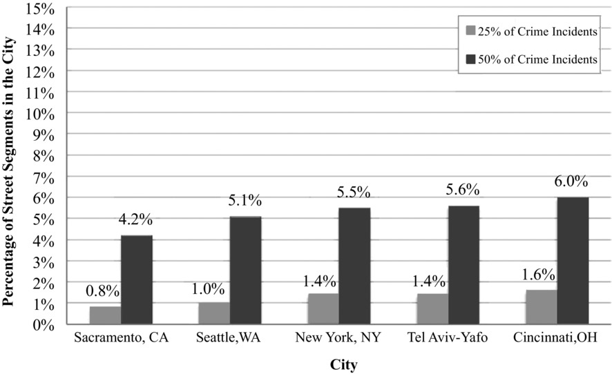
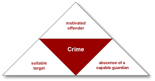
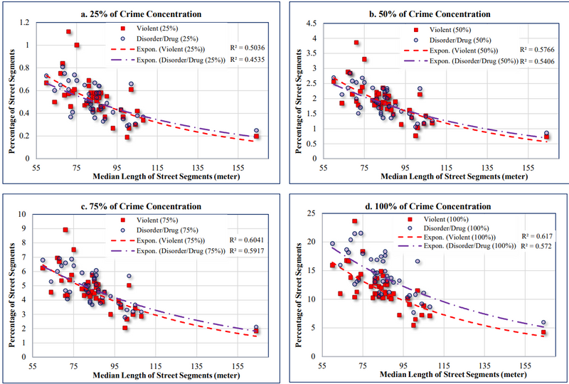
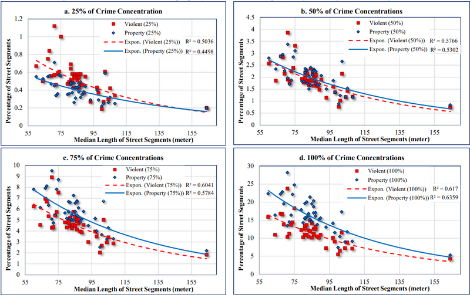
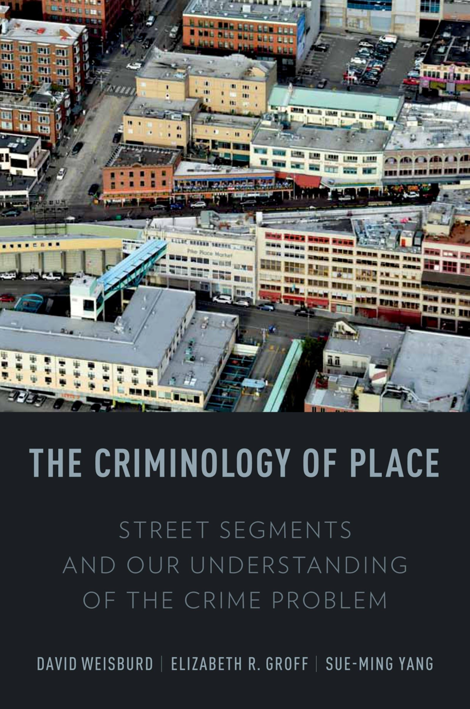
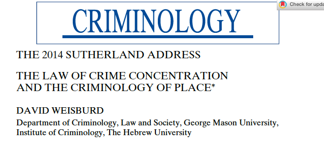
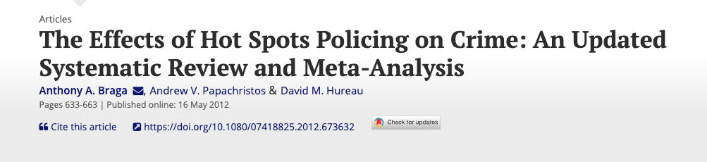
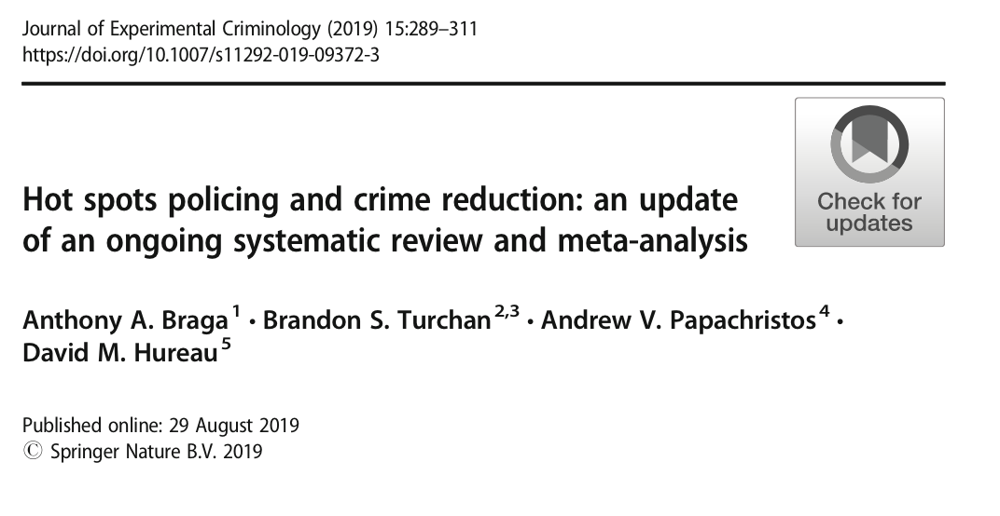
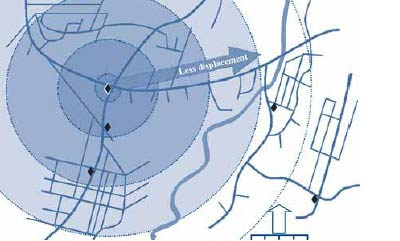

class: center, middle
background-image: url("tsu-logo.jpg")
background-position: 49% 68%
background-size: 40%

# Police II: Hot Spots & Problem-Oriented Policing
## CJ 4310: Special Problems in the Criminal Justice System

<br>
<br>

**Seth Watts, PhD**

School of Criminal Justice & Criminology

<br>
<br>
<br>
<br>
<br>
<br>


September 15, 2025

```{r setup, include=FALSE}
knitr::opts_chunk$set(echo = TRUE)
xaringanExtra::use_tachyons()
xaringanExtra::use_panelset()
```
---
class: middle

# Overview
1. Law of Crime Concentration

1. Hot Spots Policing

1. Problem-Oriented Policing

1. Critiques
---
class: center, middle, inverse

# Law of Crime Concentration

---

# Crime Concentration

```{r, echo=FALSE, out.width="45%", fig.align="center"}

```
.center.small[Source: [Weisburd, 2015](https://onlinelibrary.wiley.com/doi/abs/10.1111/1745-9125.12070)]


- Crime incidents (e.g., robberies, assaults, murders) are generally geographically concentrated

- Approximately 5% of street segments in a given city are responsible for 50% of the crime in that city

- One of the first studies to identify this trend was [Sherman, Gartin, & Buerger (1989)](https://research.ebsco.com/c/siow6l/viewer/pdf/asmhgfbhqv):

--

.quote-box[
"Relatively few “hot spots” produce most calls to Police (50% of calls in 3% of places) and calls reporting predatory crimes (all robberies at 2.2% of places, all rapes at 1.2% of places, and all auto thefts at 2.7% of places)."
]

---
class: center, middle

# What does this tell us about crime?

---
# .center[Crime is a Product of the Environment]

--

```{r, echo=FALSE, out.width="75%", fig.align="center"}

```

--

- Routine Activities Theory suggests that a crime is more likely to occur when:
  1. there is a motivated offender;
  1. a suitable target (e.g., person, place);
  1. and a lack of capable guardianship 
  
- Importantly, crime is *not* randomly distributed

---
.pull-left[
```{r, echo=FALSE, out.width="100%", fig.align="center"}

```
]

.pull-right[
```{r, echo=FALSE, out.width="100%", fig.align="center"}

```
]
.center.small[Source: [Park & Lum, 2024](https://www.crimrxiv.com/pub/zhfuyl26/release/1)]

- The Law of Crime Concentration holds for many different cities, over time, and across crime types

- This tells us something important about crime: It is *consistently* not randomly distributed

- It is highly concentrated, meaning that these areas are identifiable and responses can be tailored


---
class: center, middle

# What is the appropriate response?

---
class: center, middle, inverse
# Hot Spots Policing

---

# Hot Spots Policing

--
- One option is to send officers to the areas that produce disproportionate amount of crime (e.g., hot spots) to act as a deterrent

- One of the first rigorous test of this idea was conducted by [Lawrence Sherman and David Weisburd in 1995](https://static1.squarespace.com/static/5d809efd96f5c906aaf61f3d/t/601c032236cf8d4a7ccd459f/1612448549602/General+deterrent+effects+of+police+patrol+in+crime+HOT+SPOTS+A+randomized%2C+controlled+trial.pdf)

--

- They found that:
  - Calls for services dropped by between 6% & 13% in treatment hot spots
  - Disorder was half as prevalent in the treatment hot spots

<br>
The authors concluded:

.quote-box[
"We urge caution in generalizing its results to other settings. At the same time, we conclude that the experiment offers a more powerful and more externally valid test of the patrol deterrence hypothesis than the Kansas City experiment. At the very least, it is time for criminologists to stop saying "there is no evidence" that police patrol can affect crime."

.quote-attrib.right[Sherman & Weisburd, 1995: p. 647]
  
]
---
# Hot Spots Policing

.pull-left[ 
  .pull-left[
```{r, echo=FALSE, out.width="85%", fig.align="center"}

```
]
  .pull-right[
```{r, echo=FALSE, out.width="100%", fig.align="center"}

```
]
]

.pull-right[ 
  .pull-left[
```{r, echo=FALSE, out.width="100%", fig.align="center"}

```
[Braga et al. (2014)](https://www.tandfonline.com/doi/abs/10.1080/07418825.2012.673632); 15 studies in their meta-analysis
]
  .pull-right[
```{r, echo=FALSE, out.width="100%", fig.align="center"}

```
[Braga et al. (2019)](https://link.springer.com/article/10.1007/s11292-019-09372-3); 65 studies in their meta-analysis
]
]

--

| **Crime category** | **N studies** | **Effect size**  | **95% CI**  |
|--------------------|---------------|------------------|-------------|
|Violent crimes      |44             |.102*             |.047, .156   |
|Property crimes     |26             |.124*             |.063, .185   |
|Disorder offenses   |15             |.161*             |.101, .220   |
|Drug offenses       |10             |.244*             |.114, .373   |

.center[Adapted from Braga et al. (2019)]

---
class: center, middle

## So we just send officers to areas with higher levels of crime?

---
class: center, middle, inverse

# Problem-oriented Policing

---
# Problem-oriented Policing

<div style="position: absolute; top: 6em; right: 1em; width: 350px;">

<p style="font-size: 0.75em; text-align: center; margin-top: 0.1em; display: block; width: 100%;">Herman Goldstein</p>
</div>

.pull-left[
- Problem-oriented policing (POP) focuses on proactively addressing the underlying problems that generate crime

- Goldstein envisioned the police collaborating with other entities to address underlying issues
  - Partnerships with local agencies and non-profits
  - Communication with local business owners and landlords
  
- In essence, the law did not always have to be invoked to reduce crime

<br>
You can view the Arizona State University POP Center [here](https://popcenter.asu.edu/content/about)
]

---
# Problem-oriented Policing

<div style="text-align: center;">
```{r, echo=FALSE, message=FALSE, warning=FALSE, out.width="100%", out.height="100%"}
library(DiagrammeR)
mermaid("
graph TD
  A[Hot spots identified] --> B{POP?}
  B -->|Yes| C[SARA model]
  B -->|No| D[Other tactical approach]

  subgraph Hot Spots Policing
    C
    D
  end

")
```

</div>
---
# Problem-oriented Policing

- POP is an approach that can be used *within* hot spots

- The SARA model is the process of applying POP ([Eck & Spellman, 1987](https://journals-sagepub-com.ezproxy1.lib.asu.edu/doi/abs/10.1177/0011128787033001003))

--

<br>

|Step             |Description                                                  |
|-----------------|-------------------------------------------------------------|
|1. **Scanning**  |Scan to identify a problem driving crime or disorder issues  |
|2. **Analysis**  |Analyze the problem with a variety of data sources           |
|3. **Response**  |Tailored response to address the problem                     |
|4. **Assessment**|Evaluate the impact of the response                          |


---
class: center, middle, inverse
# Critiques Against Place-based Approaches

---
# Crime Displacement
- One important critique to this approach is that crime will simply "move around the corner"

- The empirical evidence for this phenomenon is minimal - more often that not, there is a "diffusion of benefits" (see Braga et al. 2019)

- This means that areas around the identified hot spots also experience a reduction in crime

```{r, echo=FALSE, out.width="75%", fig.align="center"}

```

.center[Source: [POP Center](https://popcenter.asu.edu/content/step-48-consider-geographical-and-temporal-displacement)]
---
# Racial Disparities

- Crime is frequently concentrated in areas that are predominately comprised of minorities

- The fear with place-based approaches is that it can result in racially-disparate policing (see [Brunson, Veléz, & Tapia, 2024](https://www-sciencedirect-com.libproxy.txstate.edu/science/article/pii/S1359178924000491); [Neil & MacDonald, 2023](https://research.ebsco.com/c/siow6l/viewer/html/pklpwbjeej))
  - Excessive stops, searches, use of force, and/or arrests in minority neighborhoods

- A heavy handed law enforcement approach could lead to harmful effects and a loss of legitimacy

---
# Short-lived Effects

- Place-based approaches tend to result in short-term reductions in crime but not sustained effects

<br>

.quote-box[
"The available research evidence strongly suggests that hot spots policing strategies produce short-term crime reduction effects without simply displacing crime into areas immediately surrounding targeted locations."

.quote-attrib.right[[Weisburd et al., 2019; p. 152](https://link-springer-com.libproxy.txstate.edu/content/pdf/10.1007/s11417-019-09284-1.pdf)]

]
---

# Key Takeaways

- Crime is highly concentrated geographically (and across people)

- Hot spots and problem-oriented policing are two evidence-based approaches to reducing crime

- These effects are short-term, tend to not result in crime displacement, and research on the intersection of proactive policing and racial disparities is growing

<br>

.quote-box[
"hot spots policing programs generate modest crime control gains and are likely to produce a diffusion of crime control benefits into areas immediately surrounding targeted high-activity crime places... Our results also make a new and very important substantive contribution to crime control theory and practice by identifying problem-oriented policing as a preferable strategy for reducing crime in hot spot locations."

.quote-attrib.right[Braga et al., 2014]
]
