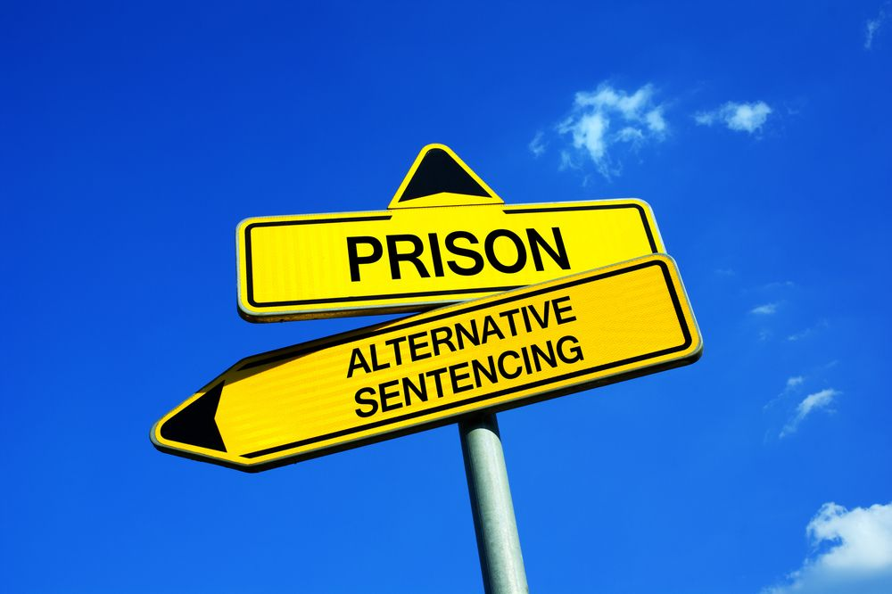

class: center, middle
background-image: url("tsu-logo.jpg")
background-position: 49% 68%
background-size: 40%

# Corrections: Prisons and Community Supervision
## CJ 4310: Special Problems in the Criminal Justice System

<br>
<br>

**Seth Watts, PhD**

School of Criminal Justice & Criminology

<br>
<br>
<br>
<br>
<br>
<br>


October 6, 2025

```{r setup, include=FALSE}
knitr::opts_chunk$set(echo = TRUE)
xaringanExtra::use_tachyons()
xaringanExtra::use_panelset()
```
---
class: middle

# Overview

1. The Role of the Correctional System

1. Do Prisons Reduce Crime?

1. Alternatives to Prison


---
class: center, middle, inverse

# The Role of the Correctional System 

---
# The Role of the Correctional System

--

1. **Deterrence**
  - Prevent offending through the risk of undesired incarceration (general deterrence)
  - Reduce future offending through experience in prison (specific deterrence)
--

1. **Incapacitation**
  - Those arrested and imprisoned cannot commit offenses
--

1. **Retribution**
  - Proverbial "eye for an eye"; punishment should be proportional to the harm committed
--

1. **Rehabilitation**
  - To correct harmful behavior and promote growth to be a law abiding citizen

<br>
.center[*The CJ system balances all four of these goals*]

---
class: center, middle

## Do these mechanisms work in practice?

---
class: center, inverse, middle

# Prison and Crime

---
# Prison: Deterrence

- Certainty of punishment > severity of punishment 

- Multiple studies find that increasing the certainty of punishment can produce deterrent effects:
  1. [Weisburd et al. (2008)](https://d1wqtxts1xzle7.cloudfront.net/73987052/j.1745-9133.2008.00487.x20211031-2182-1caxbdl-libre.pdf?1635738867=&response-content-disposition=inline%3B+filename%3DThe_Miracle_of_the_Cells_An_Experimental.pdf&Expires=1753207316&Signature=It2bEG~eEg~fRBgwEgWMysjzZ87A0qgBnRD1-bFxaKVgrH7-opjrYecPd0Y5oUZFSwcva32vSy9V1ntlWReb55zeUJux64rjU3EzVXcupB8T0ZP~UGsT-a1kmeEnr4saBeTJPCqZ5SPIWGfBWvU7hE2S8CKSNU0~JjSHgqrOm8EAnEYEkamImhHYqNy-kXt1~veHOMU8ZjLI6TTHb64tvnwgSlPwISGp4gP23XzKczFjtLA~rasBWVAwFZmsaYx-Blh-x7EdBYBe3vwu1GKIkNbr1bq-80lxQI3Ey3k4Q6RFz3NR5vgn99e~iGzXcRrFbPhqzD5sjrA0IVcO9ytwEw__&Key-Pair-Id=APKAJLOHF5GGSLRBV4ZA) ➞ clear threat of incarceration incentivized court-ordered fines to be paid
  1. [Hawken & Kleiman (2009)](https://www.ojp.gov/pdffiles1/nij/grants/229023.pdf) ➞ certain (non-draconian) punishment led to adherence to probation guidelines and fewer arrests/imprisonment 
  
- One study suggests that the three strike laws reduced crime (but the costs of TSLs outweighed benefits):
  1. [Helland & Tabarrok (2007)](https://jhr.uwpress.org/content/42/2/309.abstract) ➞ comparable individuals convicted of two offenses were 20% less likely to commit the third offense
  
.quote-box[
**Note**: the first two examples above are related to the certainty of punishment. If offending can be prevented without the use of prison, just the threat of it, you can both reduce prison populations and reduce arrests.
]

---
# Prison: Incapacitation

- From a research perspective, it is often hard to tease apart the effects of deterrence and incapacitation

- A few studies suggest that as incarceration rates grow, there is a tipping point where the benefits gained from incapacitating offenders diminishes

- Targeted imprisonment of high rate offenders will likely contribute to incapacitation effects but as low rate offenders begin to be admitted to prison at scale, the effect gets smaller ([Johnson & Raphael, 2012](https://www.journals.uchicago.edu/doi/pdf/10.1086/664073?casa_token=hpNYWO3PdocAAAAA:bmvFlsuTy2wTcKrsbrXt912ESsbwK_CuMtGlM_TWslO8DGDUxz8luTY1JcNuDkBfcKvp2q6wEw); [Useem & Piehl, 2008](https://www.cambridge.org/core/books/prison-state/D6CEDB2B07880B8F306CCDBBC21E27B8))

---
# Prison: Retribution

- The philosophical goal of retribution is not to prevent crime or reduce crime, it is simply to do to one as one has done to others

- Minor offense = less severe punishment; major offense = severe punishment

- One of the most notable forms of retribution: the death penalty

--

- In theory, the death penalty would reduce murders through a general deterrent effect (e.g., severity of punishment)

- The best available evidence suggests that the death penalty does **not** reduce murders (see [Donohue, 2009](https://www.researchgate.net/profile/John-Donohue-3/publication/240962477_The_impact_of_the_death_penalty_on_murder/links/67c16c99461fb56424ec29e4/The-impact-of-the-death-penalty-on-murder.pdf))
  - And that it is likely quite costly financially

---
# Prison: Rehabilitation

- Rehabilitation is primarily focused on altering future behavior (e.g., lowering recidivism rates)

- The guiding star of correctional rehabilitation efforts is the Risk-Need-Responsivity model:
  1. Assess an offender's level of risk to re-offend
  1. Identify which factors (needs) should be targeted to help reduce future offending
  1. Respond with tailored rehabilitation programs directed at needs
  
--

- The evidence on the effectiveness of this approach is mixed

- Some research suggests large declines in recidivism but are more likely to be lower quality studies

- Higher quality studies tend to report quite small effects (both positive and negative) and no effects

---
class: center, middle, inverse

# Alternatives to Prison

---
# Alternatives to Prison

<div style="position: absolute; top: 3em; right: 0em; width: 500px;">

</div>

1. Community supervision

--
1. Specialized courts

--
1. Drug diversion programs

--
1. Enhanced probation

---

# Community Supervision

- A form of probation that allows the offender to remain in the community but is required to meet certain probationary guidelines and rules
  - Typically used for non-violent misdemeanor offenses
  
- Frequently used in tandem with some form of rehabilitation efforts such as:
  - Substance use programs
  - Counseling
  
- **Intermediate sanctions** are often used in addition to probation which include:
  - Daily reporting centers
  - Drug tests
  - Electric monitoring 
  
---
# Community Supervision

- The evidence is mixed in terms of community supervision leading to reduction in recidivism

- Some studies find that probation (versus a prison sentence) results in fewer arrests in the future (Aizer & Doyle, 2015; Mueller-Smith, 2015), while others find no effect (Loeffler, 2013; Mitchell et al., 2017), and some find more arrests (Loeffler & Grunwald, 2015)

- Though, there is sound research in international contexts that suggest electric monitoring instead of a prison sentence reduces recidivism (DiTella & Schargrodsky, 2014; Anderson & Anderson, 2014)

- More intense levels of supervision appear to not be beneficial (Barnes et al., 2012; LaForest, 2022; Petersilia & Turner, 1993) and are costly

<br>
<br>
.quote-attrib.right[See [Doleac & LaForest (2022)](https://craftmediabucket.s3.amazonaws.com/uploads/AVCJIReport_CommunitySupervisionPublicSafety_DoleacLaForest_v2.pdf) for an overview]

---
# Specialized Courts

- Below are a few of the more common specialty courts:
  - Drug courts
  - Mental health courts
  - Youth specialty courts
  - DWI courts

- The goals of these courts are to provide tailored responses to address specific needs

--
- Drug courts tend to show consistent reductions in recidivism among participants (Mitchell, 2011), though the effect is modest

--

- DWI courts show promising results but there are only a few studies which mean more uncertainty (Mitchell, 2011)
  - Youth courts are similarly situated: lower recidivism rates among participants but non-significant, and few studies to go off of
  - Mental health courts are in the same boat (potentially reduces future offenses but there are few studies)
  
---
# Drug Diversion Programs

- Similar to drug courts, drug diversion programs tend to focus on community-based drug treatment 

- Though, diversion programs can take place at different stages (e.g., police-initiated, court-initiated)

- The goals remain the same:
  - Reduce the number of individuals with substance use issues in prison
  - Provide adequate substance use treatment in hopes to have long-lasting effects

---
# Enhanced Probation

- Enhanced probation is generally described as **intensive supervised probation (ISP)**

- Probation officers' dockets are much smaller so they can provide more attention to individual probationers

- ISP is generally comprised of **intermediate sanctions** such as house arrest, electric monitoring, day reporting centers 
 - Little is known about the effect of house arrest
 - Electric monitoring has positive effects internationally, but is mixed in the US
 - Day reporting centers have mixed research as well
      - Day reporting centers are locations for supervision and access to services

---
# Key Takeaways

- Prison in and of itself is not a great deterrent ***BUT*** if the certainty of punishment is effectively used, offending can be reduced

- Incapacitation effects are greater for highly active offenders

- There are a variety of alternatives to prison though most are understudied and/or provide mixed evidence

- Specialized courts offer promising paths to reduce incarceration and provide necessary resources
