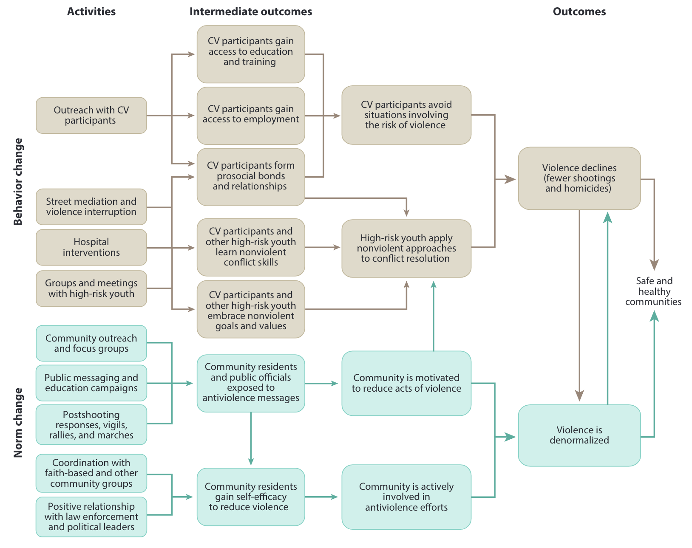

class: center, middle
background-image: url("tsu-logo.jpg")
background-position: 49% 68%
background-size: 40%

# Community-based II: Public Health Models
## CJ 4310: Special Problems in the Criminal Justice System

<br>
<br>

**Seth Watts, PhD**

School of Criminal Justice & Criminology

<br>
<br>
<br>
<br>
<br>
<br>


October 27, 2025

```{r setup, include=FALSE, echo=FALSE}
xaringanExtra::use_tachyons()
xaringanExtra::use_panelset()
```
---
class: middle

# Overview
1. What is the outreach mediation approach to violence?

1. Why has this approach gained attention?

1. Critiques

1. The evidence-base for outreach mediation models

1. Other public health approaches

---
class: center, middle, inverse

# Street outreach mediation
Butts et al. (2015)

---
# Street Outreach Mediation

Approaches violence as if it is contagious and its spread can be interrupted

--

The most well known violence outreach program:

**Cure Violence (formerly Chicago Ceasefire)**

.quote-box[
"The CV model does not involve the use of force or the threat of punishment. It presumes that violent behavior—like all behavior—responds to structures, incentives, and norms. It is designed to introduce at-risk individuals to alternative models of conflict resolution that, in turn, may spread to the larger community—essentially “denormalizing” the harmful behavior...The CV program relies on three key elements to stop the transmission of violent behavior: interrupting transmission directly, identifying and changing the thinking of potential transmitters (i.e., those at highest risk of perpetrating violence), and changing group norms regarding violence."

.quote-attrib.right[Butts et al. (2015)]

]

---

```{r, echo=FALSE, out.width="90%", fig.align="center"}

```
.center.small[Source: Butts et al. (2015)]

---
# Cure Violence Staff

**There are a couple key staff positions within the Cure Violence model**

1. *Violence interrupter (VI)*: An individual with prior gang related experience; was previously incarcerated; his views on violence changed (e.g., denormalized violence); needs to be viewed as a credible messenger among high risk youth in the CV program; form relationships with high risk youth; attempt to diffuse potentially violent situations (e.g., tit-for-tat acts of violence)

1. *Outreach worker (OW)*: An individual that is focused on connecting high risk youth to resources and support; facilitates the denormalization of violence; should be a credible messenger

Working together, the VI and OW share information and identify those at risk, those who are open to resources and support, as well as those who need more attention

---
# Cure Violence

<div style="position: absolute; bottom: 8em; right: 6em; width: 600px; height: 400px;">
<iframe width="85%" height="100%" 
        src="https://www.youtube.com/embed/mtL6yD151lU" 
        frameborder="0" 
        allow="accelerometer; autoplay; clipboard-write; encrypted-media; gyroscope; picture-in-picture" 
        allowfullscreen>
</iframe>

---
class: center, middle, inverse

# Why street outreach mediation?

---
# Why street outreach mediation?

.pull-left[
.f5[Heavy reliance on the Criminal Justice System, primarily law enforcement, can have long lasting consequences (e.g. incarceration, family separation, deadly use of force)

Law enforcement-based reductions in crime are generally short-term -- but how do we generate long-term reductions?

The originators of this approach noted that violence was "contagious" and that it could be interrupted
  - Norms and violence are passed through social networks]
]

<div style="position: absolute; top: 7em; right: 0em; width: 450px;">

<p style="font-size: 0.75em; text-align: center; margin-top: 0.1em; display: block; width: 100%;">Papachristos et al. 2015</p>
</div>


---
class: center, middle, inverse

# Evidence-base for Violence Outreach Mediation

---
# Applications of Cure Violence

1. **Safe Streets (Baltimore, MD)**
  - Some neighborhoods experienced reductions in homicides but others did not. Some had an increase, leading to mixed findings

--
1. **Save our Streets (Brooklyn, NY)**
  - There was positive treatment effect (less gun violence in treatment neighborhood compared to proximate comparison neighborhoods) though not statistically significant

--
1. **TRUCE Project (Phoenix, AZ)**
  - Overall reduction in violent events driven by a decline in assaults, though shootings increased leading to mixed findings

--
1. **One Vision One Life (Pittsburgh, PA)**
  - Associated with increases in shootings and aggravated assaults
  
---
class: center, middle, inverse

# Critiques

---
# Complexity

- Similar to focused deterrence, this approach requires significant inter- and intra-agency communication and collaboration

- This can enhance information sharing leading to better efforts, if done properly; but if relationships are not already established, program implementation can become faulty leading to an ineffective intervention

---
# Mixed evidence

- Evaluations of the Cure Violence model tends to find mixed or null findings

- Given that the cost of this program is steep, it can be hard to get a city council on board to spend millions of dollars on a program that *might* work
- A recent Cure Violence effort in St. Louis cost approximately $7 million


---
# Violence interrupters being violent

<a href="https://www.nbcwashington.com/news/local/dc-violence-interrupter-arrested-for-deadly-shooting/3874237/" target="_blank" style="text-decoration:none; color:inherit;">
  <div style="border:1px solid #ddd; padding:10px; border-radius:8px; display:flex; align-items:center;">
    <div>
      <strong>NBC Washington</strong><br>
      DC violence interrupter arrested for deadly shooting
    </div>
  </div>
</a>

<a href="https://kstp.com/kstp-news/top-news/minneapolis-pulls-violence-interrupter-contract-request-after-nonprofit-members-shooting-arrest/" target="_blank" style="text-decoration:none; color:inherit;">
  <div style="border:1px solid #ddd; padding:10px; border-radius:8px; display:flex; align-items:center;">
    <div>
      <strong>KSTP</strong><br>
      Minneapolis pulls violence interrupter contract request after nonprofit member’s shooting arrest
    </div>
  </div>
</a>

<a href="https://www.thetrace.org/2017/06/chicago-violence-interrupter-cure-violence/" target="_blank" style="text-decoration:none; color:inherit;">
  <div style="border:1px solid #ddd; padding:10px; border-radius:8px; display:flex; align-items:center;">
    <div>
      <strong>The Trace</strong><br>
      Feds Say One of Chicago’s Last ‘Violence Interrupters’ Was Really a Gang Leader
    </div>
  </div>
</a>

<br>
These are just a few stories and shouldn't be mistaken for being the rule rather than the exception

Nonetheless, this phenomenon can propose a potentially serious problem for implementing such an approach

This is not to say the programs should be dismantled or not funded **BUT** it does, at a minimum, require careful selection of the violence interrupters in the program

---
class: center, middle, inverse

# Other Public Health Models

---
# READI

Rapid Employment and Development Initiative (READI) combines employment, cognitive behavioral therapy (CBT), and other support as an intervention among high risk offenders

The goal is to provide opportunities and care to turn high risk offenders away from violence

The evidence on this particular program is promising

[Bhatt et al. (2024)](https://research.ebsco.com/c/siow6l/viewer/pdf/mc6hyfv2ez) experimentally evaluated the impact of READI in Chicago:

- **The intervention?** 18 months of employment alongside CBT, and other support

- **The sample?** Men 18 and older with a high risk of involvement in violence

- **The impact?** No significant difference between treatment and control for serious violence index; shootings and homicides decreased 65%; participants referred by outreach workers had significantly fewer arrests and victimizations (shootings and homicides); estimated savings were between $182,000 and $916,000 per participant suggesting it is cost-beneficial

---
# Advance Peace

Advance Peace is a holistic intervention that focuses on addressing internal struggles driven by structural barriers among high risk offenders

.quote-box[
"The Peacemaker Fellowship is an intensive 18-month program where clients, now called fellows, receive seven-days-a-week mentorship from an NCA (street outreach workers), who also works with the fellow to develop a Life Management Action Plan (LifeMAP)... The NCAs help the fellow achieve their LifeMAP goals though life coaching, culturally responsive counseling, and delivering or referring them to supportive services, such as cognitive behavioral therapy and substance abuse and anger management counseling. The Advance Peace program also includes weekly group life skills classes, social service navigation supports, job skills and internships, group travel opportunities, and meetings with a ‘circle of elders’. After participating in the Peacemaker Fellowship for at least six months and making progress on LifeMAP goals, a fellow becomes eligible for a monthly allowance of up to $1000."  

  .quote-attrib.right[Corburn, Nidam, Fukutome-Lopez (2022)]
]

The evidence for this approach is weak due to some of the methodologies used: many are just pre-post comparisons meaning other variables could be driving any change in the outcomes

---
# Key Takeaways

- Violence mediation approaches violence as an infectious disease that can spread through social networks; interrupting the social network can stop the spread

- Other public health approaches (READI & Advance Peace) focus on employment, cognitive behavior therapy, and trauma-informed care among high risk offenders

- The evidence-base for all of these approaches is both relatively new and mixed

  - READI has been experimentally evaluated indicating rigorous promising findings
  - Violence mediation has multiple evaluations though the findings tend to be mixed
  - Advance Peace evaluations are scant and primarily rely on pre-post methods


