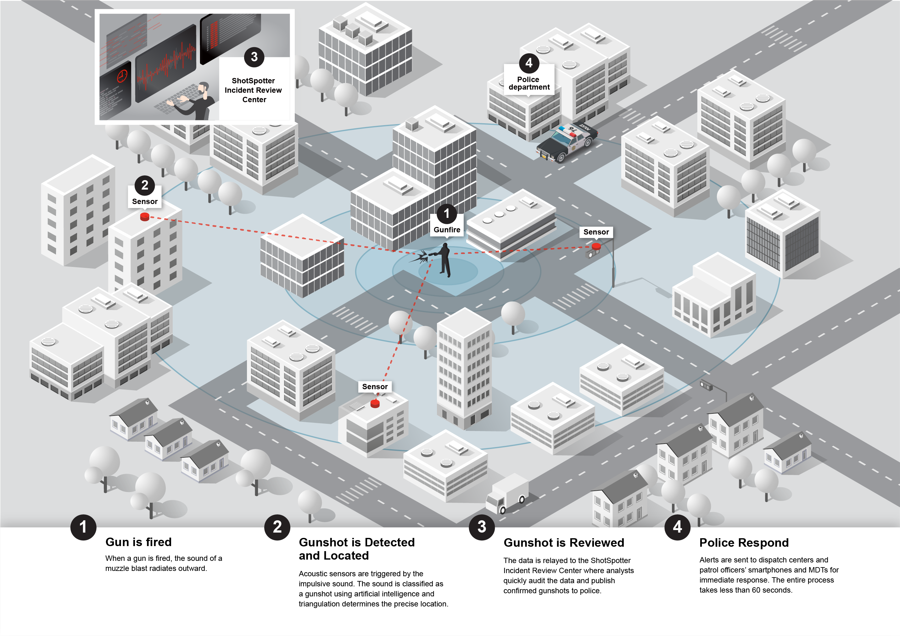

class: center, middle
background-image: url("tsu-logo.jpg")
background-position: 49% 68%
background-size: 40%

# Technology & Surveilance
## CJ 4310: Special Problems in the Criminal Justice System

<br>
<br>

**Seth Watts, PhD**

School of Criminal Justice & Criminology

<br>
<br>
<br>
<br>
<br>
<br>


November 3, 2025

```{r setup, include=FALSE, echo=FALSE}
xaringanExtra::use_tachyons()
xaringanExtra::use_panelset()
```

---
class: middle

# Overview

1. Technological innovations that are geared towards reducing crime

1. Are they effective?

1. Concerns related to increased surveilance and less privacy

---

```{r, echo=FALSE, out.width="45%", fig.align="center"}
knitr::include_graphics("panopticon.png")
```
.quote-attrib.center[Panopticon]

What does this represent?

--

- The Panopticon highlights a prison structure that allows a guard(s) to surveil all prisoners from a single vantage point

- Conceptually, the Panopticon represents the ultimate surveilance structure; a way for a person(s) in control to observe a populace at all times

--

What does this have to do with crime?

---
# Deterrence and Self-Awareness Theories

**Deterrence theory:** Humans are rational actors who want to maximize gain minimize pain
  - Swift, certain, and severe (though proportional) punishment results in law abiding behavior
  
**Self-awareness theory:** People change their behavior and adhere to social norms when they are under the impression that they are being watched
  - Similar to deterrence theory, knowing their is some level of certainty that we are being watched and judged, leads us to alter our behavior in line with generally accepted norms

.quote-box[
"In this framework, getting caught doing something morally or socially wrong is often registered as behavior that can potentially lead to negative consequences, which is an outcome that rational individuals tend to avoid...Studies have, nevertheless, uncovered a propensity to avoid negative outcomes, and findings generally agree that individuals react compliantly to even the slightest cues indicating that somebody may be watching."

.quote-attrib.right[Ariel (2016)]

]

---
class: center, middle, inverse

# Closed Circuit Television (CCTV)
Piza et al. (2019)

---
# CCTV

.wrap-right[

.quote-attrib.center[Closed circuit television (CCTV)]
]

- The first CCTV camera in the US was commercially available in the 1940s but the widespread adoption of CCTV cameras was not until the 1990s

- CCTV captures citizen behavior 24/7

- Acts as a deterrent because citizens are being "watched," which is considered a risk in deciding to commit a crime
  - Recall our section on CPTED - CCTV acts as a target hardening technology

---
# CCTV Evidence

- While there was an overall effect that indicated a modest and significant decline in crime, there was some interesting variation to note:

  - Significant effects in car parks and residential areas
  
  - Significant effects for drug crimes, property crimes, and vehicle crimes
  
  - Most studies were in the UK; significant effects were observed in the UK and South Korea
  
  - Significant effect when CCTV was being actively monitored (vs passively)
  
- Depending on the crime problem and resources devoted, CCTV could be an effective intervention
 
---
class: center, middle, inverse

# Automated License Plate Readers (ALPRs)

---
# ALPRs

.wrap-right[


.quote-attrib.center[Automated license plate reader (ALPR)]
]

- License plate readers began to gain traction around 2005 in the US and quickly became a widely adopted technology
  - The UK has been using LPR technology for decades

- Instead of an officer calling dispatch to run a plate, the ALPR does this in a more efficient manner 

- Primarily adopted to help address auto-related crimes

- The technology is quite expensive at around $20,000 per unit

---
# ALPR Evidence

There have been some experimental evaluations of ALPRs - here is what the research says:

.panelset[
  .panel[.panel-name[Lum et al. (2011)]
  
In this RCT, the authors found that ALPRs situated in auto theft hot spots did not produce crime reductions

.quote-box[

"Our findings indicate that, when small numbers of LPR patrols are used in crime hot spots in the way we have tested them here, they do not seem to generate either a general or offense-specific deterrent effect."
]
  ]

  .panel[.panel-name[Koper et al. (2013)]
  
The authors found that ALPRs reduced drug crimes but not other crimes in hot spots
  - The mechanism for this finding is unclear and could simply be an artifact of police presence not the ALPR

.quote-box[
"Compared to control conditions with standard patrol strategies, the LPR locations had reductions in calls for drug offenses that lasted for at least several weeks beyond the intervention, while the non-LPR, manual check locations exhibited briefer reductions in calls regarding person offenses and auto theft. There were also indications of crime displacement associated with some offenses, particularly drug offenses."
]
  ]
  
  .panel[.panel-name[Wheeler & Phillips (2018)]
  
The authors found that ALPRs contributed to a 20% reduction in traffic accidents among treated areas compared to control areas, though that effect was sensitive (quasi-experiment)

.quote-box[
"The evaluation of the deterrent effect of Operation Strikeforce, using ALPR at micro place hot spots of crime in Buffalo, NY, has resulted in mixed findings. In the best case scenario, the results presented here indicate a deterrent effect of roadblocks on Part 1 Violent crimes (around 10 crimes over all locations and the two-month period) and traffic accidents (around a 20% reduction). These are both moderately sized effects for a one-time-only intervention, but the results are not robust when considering different statistical methods. Given the inconsistency of the findings, one can only state that the results are promising when ALPRs are used in concert with checkpoints at crime hot spots."
]
  ]
  
  .panel[.panel-name[Koper et al. (2022)]
  
In this quasi-experiment, ALPRs were associated with an increase of stolen vehicle recoveries but not arrests; did not reduce the likelihood of a new call 

.quote-box[
"This study provides little clear evidence for the crime prevention efficacy of using LPRs in general patrol, which is a common practice in the USA. Police and researchers should give more attention to testing the relative benefits of different LPR uses and modes of deployment."
]
  ]
  
  .panel[.panel-name[Summary]

Evidence is largely mixed in terms of ALPRs effectiveness

The cost is also quite steep, if the the benefits are minimal or hard to come by, it may be more costly than beneficial

Though, targeted placement of ALPRs may be more cost-beneficial

  .quote-box[
"LPRs continue to be widely used in law enforcement, despite a lack of strong research evidence for their crime prevention benefits. Further studies are needed on the most effective ways for agencies to utilize small numbers of LPRs and the potential return on investment for acquiring larger numbers of the devices."

.quote-attrib.right[Lum et al. (2019)]
]

  ]
]

---
class: center, middle, inverse

# Gun Shot Detection Systems (GDT)
Connealy et al. (2024)

---
# GDT

```{r, echo=FALSE, out.width="90%", fig.align="center"}

```
.quote-attrib.center[Shot Spotter: GDT]

---
# GDT

Gun shot detection systems could impact crime in two ways:

1. **Prevention**: the presence of gun shot detection systems reduce shootings because they act as an increased risk

1. **Procedural**: their presence allows for police to respond quicker, collect more evidence, identify suspects quicker

<div style="text-align: center;">
```{r, echo=FALSE, message=FALSE, warning=FALSE, out.width="100%", out.height="100%"}
library(DiagrammeR)
mermaid("
graph LR
  A[Shooting] --> B[GDT detects shooting]
  B --> C{Quick police response} 
  C --> D[EMS transport]
  D --> E[Better chance of nonfatal shooting]
  C --> F[Better evidence collection]
  F --> G[Increased likelihood of arrest]

")
```

</div>

---
# GDT Evidence 

The evidence of GDT is underwhelming:

.panelset[
  .panel[.panel-name[Connealy et al. (2024)]
  - GDT was associated with improvements in gun recoveries
  
  - No reductions in shootings, fatal shootings, nonfatal shootings, or shots fired calls for service
]

.panel[.panel-name[Piza et al. (2023)]
  - Found that shots fired called in the treatment areas (with GDT) were more likely to be false positives (not actually shots fired)
  
  - GDT did not improve evidence collection or clearance rates for shootings
]

.panel[.panel-name[Lawrence et al. (2019)]
  - Did not improve clearance rates or gun recoveries
  
  - May have helped the recovery of shell casings
]
]
---
class: center, middle, inverse

# Concerns

---
# Concerns 

- From a resource allocation perspective, investment into these technologies may not have a large return casting doubt on their utility

--
- The expansion of technology and the desire for transparency both eat away at privacy

- With any intervention that targets criminal activity, because it is concentrated geographically, some populations may be subject to more police interventions and a loss of privacy

---
# Key takeaways

- CCTV cameras appear to have some crime reducing effects when placed in certain areas and for particular offenses

- Evaluations of both ALPRs and GDT generally find mixed evidence

- Does the evidence suggest ALPRs or GDT are worth the cost? Maybe not...


