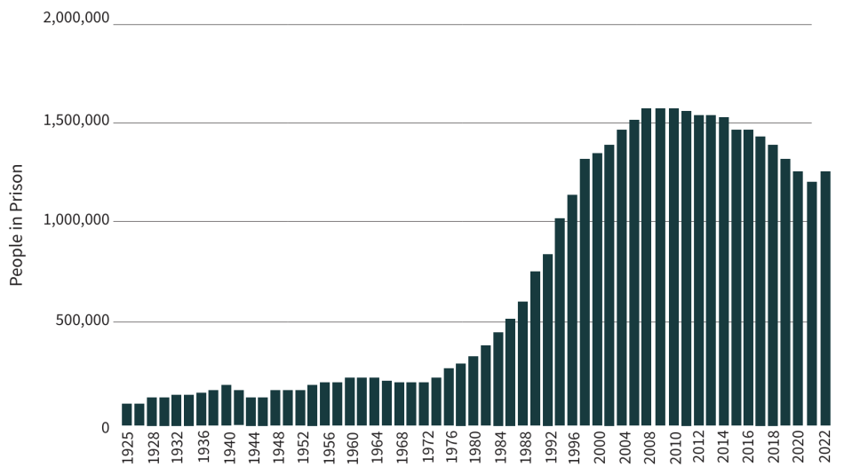
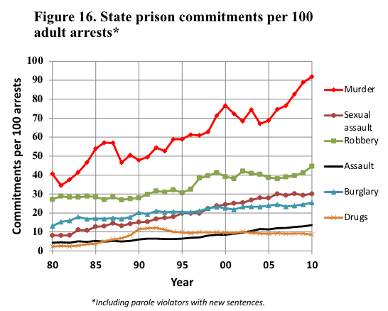
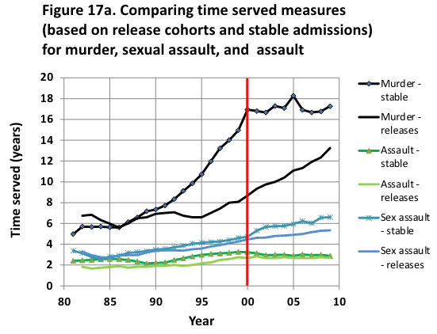
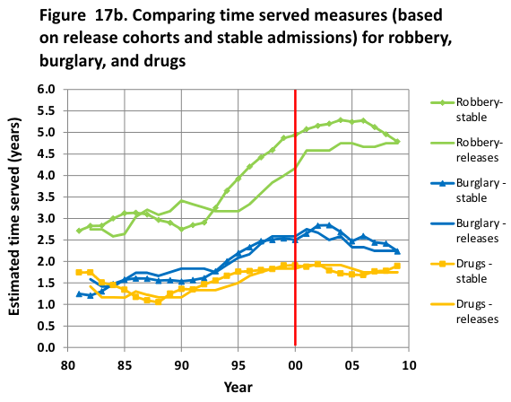
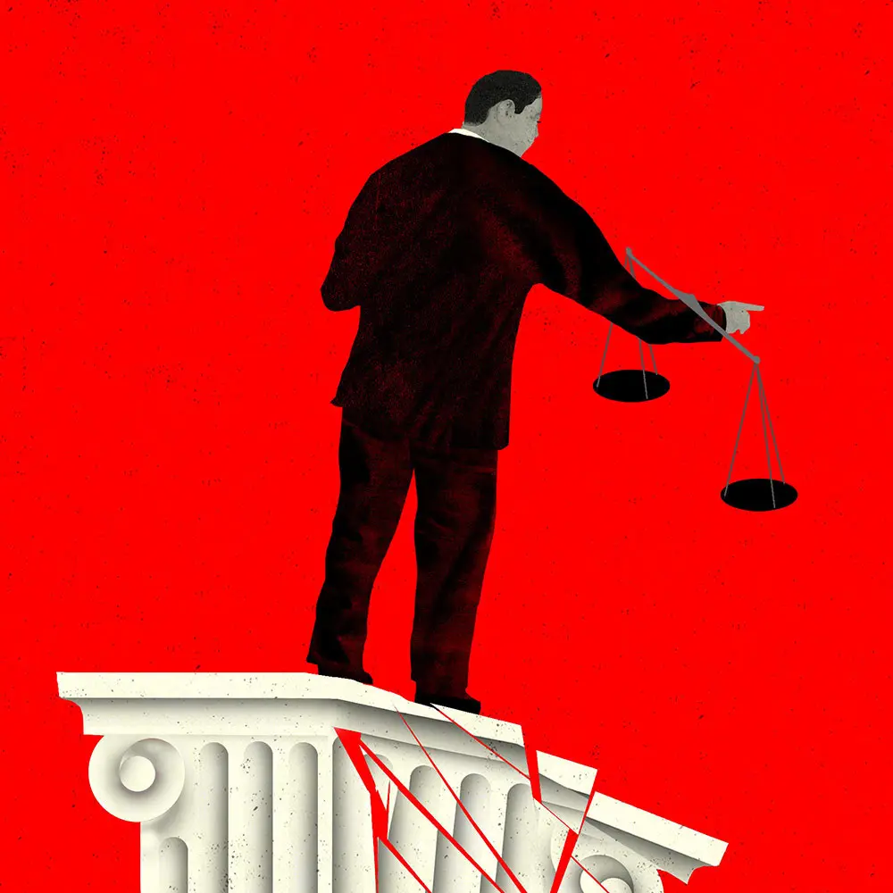
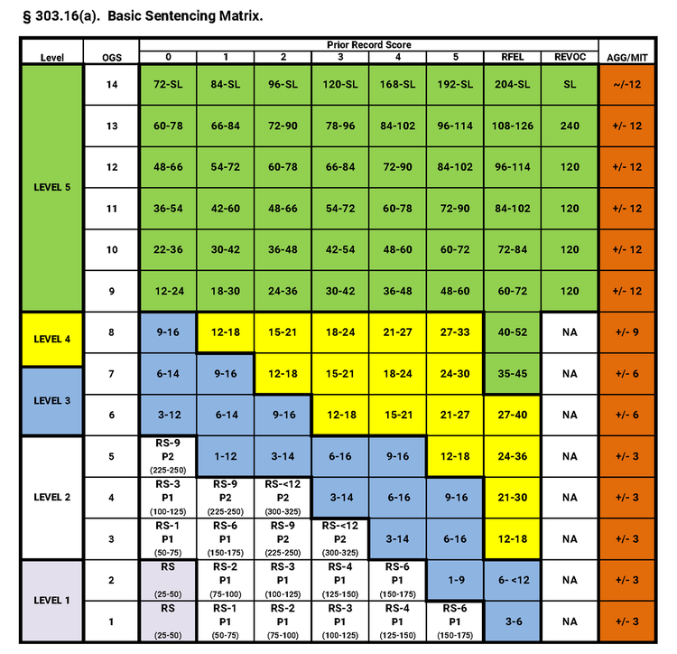

class: center, middle
background-image: url("tsu-logo.jpg")
background-position: 49% 68%
background-size: 40%

# Courts: Prosecutors & Sentencing
## CJ 4310: Special Problems in the Criminal Justice System

<br>
<br>

**Seth Watts, PhD**

School of Criminal Justice & Criminology

<br>
<br>
<br>
<br>
<br>
<br>


September 28, 2025

```{r setup, include=FALSE}
knitr::opts_chunk$set(echo = TRUE)
xaringanExtra::use_tachyons()
xaringanExtra::use_panelset()
```
---
class: middle

# Overview

1. Mass incarceration

1. The evolution of sentencing policy in the US

1. The evidence of sentencing policies effect on crime

---
class: center, middle, inverse

# Mass Incarceration
Mays & Ruddell (2019)

---
# Mass Incarceration

<br>

```{r, echo=FALSE, out.width="85%", fig.align="center"}

```
.center[Source: [Sentencing Project](https://www.sentencingproject.org/reports/mass-incarceration-trends/)]

---
class: left, middle

## Why?

---
# Mass Incarceration

[Pfaff (2014)](https://ir.lawnet.fordham.edu/cgi/viewcontent.cgi?article=1594&context=faculty_scholarship) suggests that:
1. War on Drugs is an insufficient explanation for the rise in incarceration
1. Downplaying the rise in violent and property crime misses why incarceration increased
1. Focusing on longer sentences misses the fact that admissions increased
1. The CJS is a fragmented system, not coherent system
1. The Politics of crime are *not* uniquely dysfunctional

--

Pfaff argues that the focus should be on:
1. Violent and property crime
1. Less on sentence length and more on admissions to prison
1. The lack of institutional accounts

---
class: left, middle

## What drove mass incarceration?

---
# Mass Incarceration

--
1. Rise in violent & property crime ☒

--
1. Longer sentences ☑ 

--
1. Commits per arrest ☑ 

--
1. War on Drugs...somewhat

--
- Strongest contributors to the rise in incarceration: 1) commits per arrest and 2) longer sentences (Beck & Blumstein, 2012)
  - To a lesser extent, the CJS response to drug offenses
  - Though, this factor greatly contributed to the racial disparity in incarceration

- This points to the power prosecutors had (and have) in shaping incarceration trends

<div style="position: absolute; bottom: 0em; right: 8em; width: 500px; height: 250px;">
<iframe width="85%" height="85%" 
        src="https://www.youtube.com/embed/TYo67Q9Kzmc" 
        frameborder="0" 
        allow="accelerometer; autoplay; clipboard-write; encrypted-media; gyroscope; picture-in-picture" 
        allowfullscreen>
</iframe>

</div>

---
# Mass Incarceration

```{r, echo=FALSE, out.width="40%", fig.align="center"}

```

--
.pull-left[
```{r, echo=FALSE, out.width="90%", fig.align="center"}

```
]
.pull-right[
```{r, echo=FALSE, out.width="90%", fig.align="center"}

```
]
.center.small[Source: Beck & Blumstein, 2012]

---
class: center, middle, inverse

# The evolution of sentencing policy in the US
Mays & Ruddell (2019)

---
# Indeterminate ➞ Determinate Sentencing

.pull-left[
### Indeterminate sentencing
- Built on the idea that offenders could be rehabilitated
- Early release conditional on life skills/educational programs
- Disciplinary problems and no rehabilitation programming meant longer sentences
]

--

.pull-right[
### Determinate sentencing
- Fixed sentences, regardless of rehabilitative programming
- Some states eliminated parole completely

]

---
class: left, middle

## Did determinate sentencing laws reduce crime?

---
# Determinate Sentencing Effect on Crime

The short answer: likely not (see [Marvell & Moody, 1996](https://research.ebsco.com/c/siow6l/viewer/pdf/mosnbago4b))

It appears determinate sentencing did not contribute to large increases in prison populations either

Though, there was substantial variation from state-to-state:

1. Indiana's prison population grew but Minnesota and Washington showed declines

1. An increase in court commitments in Indiana and California but fewer in New Mexico

1. Connecticut and Illinois laws were associated with declines in crime while New Mexico may have had an increase


---
# Prosecutorial Discretion

<div style="position: absolute; top: 6em; right: 0em; width: 450px;">

<p style="font-size: 0.75em; text-align: center; margin-top: 0.1em; display: block; width: 100%;">Vera Institute</p>
</div>

.pull-left[
1. Prosecutors have discretion in prosecuting a case or not

1. Prosecutors set the charges

1. Prosecutors and plea bargaining
  - Plea bargaining *can* be useful for all parties involved (trials are oftentimes uncertain and risky)
  - However, if prosecutors overcharge, the plea agreement will likely not be a "win" for the defense

]

---
# Sentencing Guidelines

<div style="position: absolute; top: 6em; right: 0em; width: 500px;">

<p style="font-size: 0.75em; text-align: center; margin-top: 0.1em; display: block; width: 100%;">Pennsylvania Sentencing Matrix</p>
</div>

.pull-left[
Sentencing guidelines are the product of politicians believing that judges had too much power

Some felt this power resulted in racial disparities in sentencing

Guidelines confine judges to a range of sentences based on prior record and severity of the current offense

The first sentencing guideline was established in Minnesota in 1980

See a description of [Pennsylvania's matrix](https://www.philacriminaldefenseattorney.com/legal-knowledge/pennsylvania-sentencing-guidelines/)
]


---
class: left, middle

## Do sentencing guidelines have any effect on recidivism?

---
# Sentencing Guidelines Effect on Recidivism

[Estelle & Philips (2018)](https://www-sciencedirect-com.ezproxy1.lib.asu.edu/science/article/pii/S0047272718300860?casa_token=0n98NonLxnIAAAAA:GR4ZrDcu_v2NJQohR_J5SEHxHwD54u5InUPHyA7502G9OpxOXQVfdI41cDVQD5VYEvTehmQZ) looked at shoplifting and repeat drunk driving offenses in Michigan 

- They find that harsher sentences seem to reduce recidivism for felony shoplifters but not repeat drunk driving offenses

- They also note that there is substantial variation by age, sex, geography, and prior record

--

[Bushway & Owens (2013)](https://www-journals-uchicago-edu.libproxy.txstate.edu/doi/10.1086/669715) look at a state-level shift in *recommended* -not actual- sentencing for 25 different offenses in Maryland

  - They find that a 10 percent increase in the recommended sentence, holding actual punishment constant, is associated with a 1.2 percent increase in recidivism

- They suggest that when there is a gap between expected punishment (recommended) and actual punishment, it can be harmful

---
# Mandatory Minimum Sentence

Lower-bound threshold for a sentence

Judges have some discretion here leading to a non-uniform application of the laws 

Likewise, prosecutors have discretion in pursuing charges that include a mandatory minimum

.quote-box[
**Example**: Of the 64,124 cases reported to the Commission in fiscal year 2023 17,080 involved an offense carrying a statutory mandatory minimum penalty. 16.3% of all individuals were subject to a mandatory minimum penalty at sentencing.

.quote-attrib.right[[US Sentencing Commission](https://www.ussc.gov/research/quick-facts/mandatory-minimum-penalties)]
]

---
# Three-Strikes Laws

Primary goal was to deter and incapacitate repeat offenders convicted of serious felonies

First state to adopt this legislation was Washington, others followed suit quickly

One of the primary concerns was "wobbler" cases:

.quote-box[
**Case Law**: Ewing v. California: A repeat offender was sentenced to 25-to-life following his third strike - the theft of three golf clubs, $399 each. The prosecutor could have filed the charge as a misdemeanor but elevated it to a felony, meeting the three strike criteria.
]

---
class: left, middle

## Did three-strikes laws reduce crime?

---
# Did Three-Strikes Laws Reduce Crime?

--

It doesn't appear so...

--

Multiple studies have suggested that three-strikes laws have either no effect at all or actually increase crime (see [Marvell & Moody, 2001](https://www.journals.uchicago.edu/doi/abs/10.1086/468112); [Kovandzic et al. 2004](https://www.tandfonline.com/doi/abs/10.1080/07418820400095791?casa_token=OsXo732mpdQAAAAA:cRCaMYk0GAFcrbBoDSeclUFmJmMUWr0PnTjzIWEr_B4hxAuIgo_ddUbIsGYJesvfACTD07QBiLI); [Worrall, 2004](https://www.sciencedirect.com/science/article/pii/S0047235204000388?casa_token=AUkJezBhl9MAAAAA:mxvmUworAK_bNVYlMejKmobniLbtqZTukL-fWKinKYYlUONzhUfQr8n4ooP1Ck7vYeZk9Nn5))

This could mean a variety of things:
  1. Longer sentences for repeat offenders is ineffective at reducing crime
  2. The application of three-strikes laws was ineffective (e.g., not applied in some places, applied to too many 'wobblers')
  3. Severity of punishment is less likely to change perceptions of risk

---
# Truth-in Sentencing

Violent offenders were to serve 85% of their sentence before parole eligibility 

Non-violent offenders with connections to family, friends, and the community may be released early

--

Truth-in Sentencing laws did not drive mass incarceration but it helped maintain it by increasing time served

---
# Key Takeaways

Mass incarceration was largely driven by 1) commits per arrest (prosecutorial power), 2) time served (third strike, truth-in sentencing, lengthier sentences in guidelines), and to a lesser extent 3) the War on Drugs

Prosecutors have significant power

Many laws or policies that increase the severity of punishment have negligible effects on crime

--

<br>

.quote-box[
Achieving a reduction [in the prison population] will require reversing many of the legislated policy changes that contributed to the rise. These include decreasing the use of mandatory-minimum sentences and sentences that are legislatively prescribed; restoring more flexibility in parole and other release decisions; restoring more sentencing discretion to judges, who have less incentive to respond to political appeals or for appearing “tough on crime" and reducing the volume of returns to prison related to technical violations of the conditions of release.

.quote-attrib.right[Beck & Blumstein (2012)]
]
